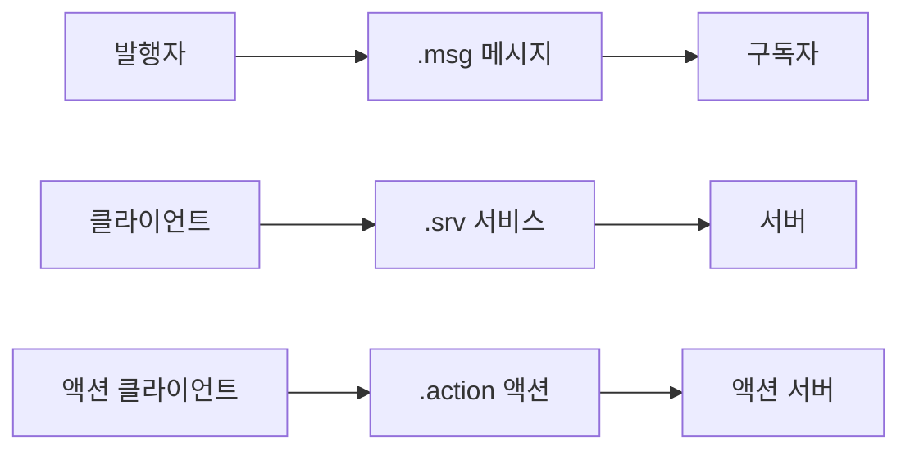

# 10. ROS2 사용자 정의 인터페이스 메시지

### 1. 통신 인터페이스 소개

ROS2의 토픽, 서비스, 액션은 모두 통신 인터페이스를 사용합니다. 인터페이스는 노드 사이에 주고받는 데이터의 표준 구조이며, 노드가 서로의 내부 구현을 알 필요 없이 통신하게 합니다.



### 2. 사용자 정의 인터페이스 생성 과정

1. 인터페이스 패키지를 만듭니다.
2. `.msg`, `.srv`, `.action` 파일을 작성합니다.
3. `package.xml`과 `CMakeLists.txt`를 설정합니다.
4. 패키지를 컴파일합니다.
5. `ros2 interface show`로 인터페이스를 확인합니다.

### 3. 사용자 정의 액션 인터페이스

액션 인터페이스 생성 과정은 9장의 `Progress.action` 예제를 참고합니다. 액션 파일은 목표, 결과, 피드백을 `---`로 구분합니다.

```action
int64 num
---
int64 sum
---
float64 progress
```

### 4. 사용자 정의 토픽 메시지 인터페이스

### 4.1. `Person.msg` 만들기

`pkg_interfaces` 패키지 아래에 `msg` 디렉터리를 만들고 `Person.msg` 파일을 작성합니다.

```bash
mkdir -p pkg_interfaces/msg
```

```msg
string name
int32 age
float64 height
```

### 4.2. 빌드 설정

`CMakeLists.txt`의 `rosidl_generate_interfaces`에 메시지 파일을 등록합니다.

```cmake
find_package(rosidl_default_generators REQUIRED)

rosidl_generate_interfaces(${PROJECT_NAME}
  "action/Progress.action"
  "msg/Person.msg"
)
```

`package.xml`에 다음 의존성을 추가합니다.

```xml
<buildtool_depend>rosidl_default_generators</buildtool_depend>
<exec_depend>rosidl_default_runtime</exec_depend>
<depend>action_msgs</depend>
<member_of_group>rosidl_interface_packages</member_of_group>
```

### 4.3. 컴파일 및 확인

작업 영역 최상위 디렉터리에서 컴파일한 뒤 인터페이스를 확인합니다.

```bash
colcon build --packages-select pkg_interfaces
source install/setup.bash
ros2 interface show pkg_interfaces/msg/Person
```

출력은 `Person.msg`에 정의한 세 필드와 같아야 합니다.

### 5. 사용자 정의 서비스 인터페이스

### 5.1. `Add.srv` 만들기

`pkg_interfaces` 아래에 `srv` 디렉터리를 만들고 `Add.srv` 파일을 작성합니다. `---` 위는 요청, 아래는 응답입니다.

```bash
mkdir -p pkg_interfaces/srv
```

```srv
int32 num1
int32 num2
---
int32 sum
```

### 5.2. 빌드 설정

`CMakeLists.txt`에 서비스 파일도 추가합니다.

```cmake
rosidl_generate_interfaces(${PROJECT_NAME}
  "action/Progress.action"
  "msg/Person.msg"
  "srv/Add.srv"
)
```

`package.xml`의 의존성 설정은 메시지 인터페이스와 동일합니다.

### 5.3. 컴파일 및 확인

```bash
colcon build --packages-select pkg_interfaces
source install/setup.bash
ros2 interface show pkg_interfaces/srv/Add
```

출력에서 요청 필드 `num1`, `num2`와 응답 필드 `sum`을 확인할 수 있습니다.
