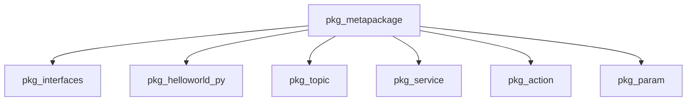

# 12. ROS2 메타 패키지

### 1. 메타 패키지 소개

하나의 로봇 기능은 여러 ROS2 패키지로 구성될 수 있습니다. 메타 패키지는 실행 코드 대신 관련 패키지의 의존성을 묶어 설치를 편하게 하는 가상 패키지입니다. 예를 들어 `ros-humble-desktop`은 여러 ROS2 패키지를 함께 설치하는 메타 패키지입니다.



### 2. 목적

메타 패키지는 서로 관련된 패키지를 하나의 이름으로 관리하고 설치할 수 있게 합니다. 자체 실행 파일은 만들지 않으며, 선언한 의존성 패키지를 함께 설치하거나 배포하는 용도로 사용합니다.

### 3. 메타 패키지 만들기

### 3.1. 패키지 생성

```bash
cd workspace/src
ros2 pkg create pkg_metapackage
```

### 3.2. `package.xml` 설정

`package.xml`의 `<exec_depend>`에 함께 관리할 패키지를 추가합니다.

```xml
<?xml version="1.0"?>
<package format="3">
  <name>pkg_metapackage</name>
  <version>0.0.0</version>
  <description>ROS2 학습 패키지를 묶는 메타 패키지</description>
  <maintainer email="user@example.com">user</maintainer>
  <license>Apache-2.0</license>

  <buildtool_depend>ament_cmake</buildtool_depend>
  <exec_depend>pkg_interfaces</exec_depend>
  <exec_depend>pkg_helloworld_py</exec_depend>
  <exec_depend>pkg_topic</exec_depend>
  <exec_depend>pkg_service</exec_depend>
  <exec_depend>pkg_action</exec_depend>
  <exec_depend>pkg_param</exec_depend>

  <export>
    <build_type>ament_cmake</build_type>
  </export>
</package>
```

### 3.3. `CMakeLists.txt` 설정

메타 패키지에는 빌드할 소스 코드가 없으므로 `ament_package()`만 선언하면 됩니다.

```cmake
cmake_minimum_required(VERSION 3.5)
project(pkg_metapackage)

find_package(ament_cmake REQUIRED)

ament_package()
```

### 3.4. 컴파일

```bash
colcon build --packages-select pkg_metapackage
```

메타 패키지는 실행 파일을 생성하지 않습니다. 컴파일 결과는 의존성 정보가 등록된 패키지입니다.
