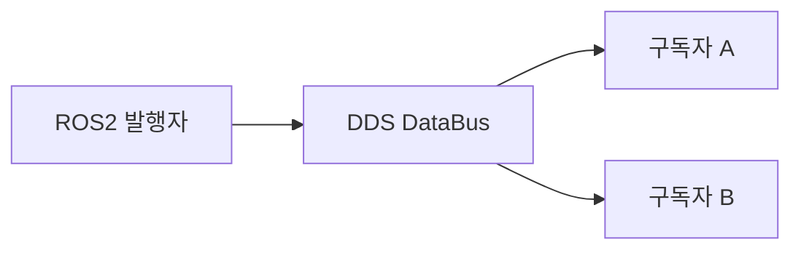

# 14. ROS2 DDS

### 1. DDS 소개

DDS(Data Distribution Service)는 실시간 분산 시스템을 위한 데이터 중심 발행/구독 표준입니다. ROS2의 토픽·서비스·액션 통신은 DDS 위에서 동작하며, 노드 발견과 데이터 전송을 처리합니다.



### 2. DDS 통신 모델

DDS는 중앙 브로커 없이 노드가 DataBus에서 필요한 토픽만 발행하거나 구독하게 합니다. 이 구조는 ROS1의 중앙 마스터 의존성을 줄이고 분산 시스템의 확장성과 장애 허용성을 높입니다.

### 3. ROS2에서의 DDS

ROS2의 상위 API는 DDS를 직접 다루지 않아도 됩니다. 노드는 같은 DDS 도메인에서 자동으로 발견되고, 개발자는 로봇 기능과 통신 정책(QoS)을 설정하는 데 집중할 수 있습니다.

### 4. QoS(Quality of Service)

QoS는 데이터 송수신의 품질 정책입니다. 발행자와 구독자의 QoS는 호환되어야 합니다.

| 정책 | 설명 |
| --- | --- |
| `DEADLINE` | 데이터가 지정한 시간 안에 도착해야 함 |
| `HISTORY` | 보관할 과거 메시지 수 |
| `RELIABILITY` | `BEST_EFFORT` 또는 `RELIABLE` 전송 방식 |
| `DURABILITY` | 늦게 참여한 노드에 과거 데이터를 제공하는 방식 |

`BEST_EFFORT`는 일부 손실을 허용해 지연을 줄이고, `RELIABLE`은 손실 메시지 재전송을 시도합니다.

### 5. 명령행 QoS 테스트

첫 번째 터미널에서 `BEST_EFFORT` QoS로 메시지를 발행합니다.

```bash
ros2 topic pub /chatter std_msgs/msg/Int32 "data: 66" --qos-reliability best_effort
```

다른 터미널에서 `RELIABLE`로 구독하면 QoS가 맞지 않아 경고가 발생할 수 있습니다.

```bash
ros2 topic echo /chatter --qos-reliability reliable
```

발행자와 동일한 QoS로 구독합니다.

```bash
ros2 topic echo /chatter --qos-reliability best_effort
```

### 6. Python QoS 토픽 예제

패키지를 만듭니다.

```bash
ros2 pkg create learning_dds --build-type ament_python --dependencies rclpy std_msgs
```

`dds_controller_pub.py`는 `RELIABLE` QoS로 `/robot_cmd` 토픽을 발행합니다.

```python
import rclpy
from rclpy.node import Node
from rclpy.qos import QoSHistoryPolicy, QoSProfile, QoSReliabilityPolicy
from std_msgs.msg import String


class ControllerPublisher(Node):
    def __init__(self):
        super().__init__('robot_controller_pub')
        qos = QoSProfile(
            reliability=QoSReliabilityPolicy.RELIABLE,
            history=QoSHistoryPolicy.KEEP_LAST,
            depth=1,
        )
        self.publisher = self.create_publisher(String, '/robot_cmd', qos)
        self.commands = ['forward', 'backward', 'stop']
        self.index = 0
        self.timer = self.create_timer(1.0, self.publish_command)

    def publish_command(self):
        msg = String(data=self.commands[self.index % len(self.commands)])
        self.publisher.publish(msg)
        self.get_logger().info(f'제어 명령 발행: {msg.data}')
        self.index += 1


def main(args=None):
    rclpy.init(args=args)
    node = ControllerPublisher()
    rclpy.spin(node)
    node.destroy_node()
    rclpy.shutdown()
```

`dds_robot_sub.py`는 발행자와 호환되는 `RELIABLE` QoS로 구독합니다.

```python
import rclpy
from rclpy.node import Node
from rclpy.qos import QoSHistoryPolicy, QoSProfile, QoSReliabilityPolicy
from std_msgs.msg import String


class RobotSubscriber(Node):
    def __init__(self):
        super().__init__('robot_subscriber')
        qos = QoSProfile(
            reliability=QoSReliabilityPolicy.RELIABLE,
            history=QoSHistoryPolicy.KEEP_LAST,
            depth=1,
        )
        self.subscription = self.create_subscription(String, '/robot_cmd', self.callback, qos)

    def callback(self, msg):
        self.get_logger().info(f'제어 명령 수신: {msg.data}')


def main(args=None):
    rclpy.init(args=args)
    node = RobotSubscriber()
    rclpy.spin(node)
    node.destroy_node()
    rclpy.shutdown()
```

`setup.py`의 `console_scripts`에 두 실행 항목을 추가합니다.

```python
'dds_controller_pub = learning_dds.dds_controller_pub:main',
'dds_robot_sub = learning_dds.dds_robot_sub:main',
```

컴파일하고 각각의 터미널에서 발행자와 구독자를 실행합니다.

```bash
colcon build --packages-select learning_dds
source install/setup.bash
ros2 run learning_dds dds_controller_pub
```

```bash
ros2 run learning_dds dds_robot_sub
```

실제 시스템에서는 영상·제어·원격 통신 등 데이터 특성에 맞는 QoS 정책을 선택하고, 통신하는 노드끼리 호환되는 정책을 사용해야 합니다.
