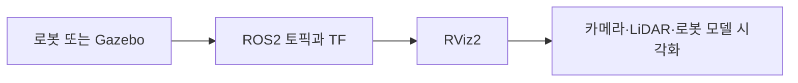
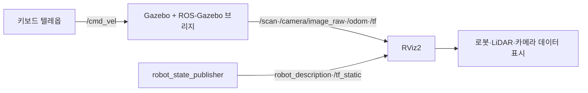

# 17. ROS2 RViz2 사용

### 1. RViz2 소개

RViz2는 로봇 모델, 좌표계, 센서 데이터, 경로와 환경 정보를 사람이 볼 수 있도록 시각화하는 ROS2 도구입니다. 센서 데이터는 알고리즘이 사용하고, RViz2는 개발자가 그 결과를 빠르게 확인하게 합니다.



Gazebo와 RViz2의 역할은 다릅니다. Gazebo는 로봇의 물리 동작과 센서 데이터를 시뮬레이션하고, RViz2는 ROS2 토픽을 구독해 그 결과를 화면에 표시합니다. RViz2 자체는 로봇을 움직이거나 물리 시뮬레이션을 수행하지 않습니다.



### 2. 준비

실제 로봇이 있다면 로봇 컨트롤러에서 RViz2를 실행하고 다중 장치 통신으로 센서 데이터를 받을 수 있습니다. 로봇이 없으면 TurtleBot3 Gazebo 시뮬레이터를 사용합니다.

Jazzy에서는 와일드카드 대신 Gazebo 패키지를 명시적으로 설치합니다.

```bash
sudo apt update
sudo apt install ros-jazzy-turtlebot3-gazebo ros-jazzy-turtlebot3-description
source /opt/ros/jazzy/setup.bash
```

로봇 모델을 설정한 뒤 시뮬레이션을 시작합니다.

```bash
export TURTLEBOT3_MODEL=waffle
ros2 launch turtlebot3_gazebo turtlebot3_world.launch.py
```

### 3. RViz2 시작

Gazebo를 실행한 터미널은 종료하지 않고 유지합니다. 새 터미널에서 TurtleBot3 Gazebo 패키지가 제공하는 RViz2 설정을 사용해 실행합니다. 이 설정에는 `odom` Fixed Frame, `/scan` LaserScan, `robot_description` RobotModel이 미리 포함되어 있습니다.

```bash
source /opt/ros/jazzy/setup.zsh
rviz2 -d /opt/ros/jazzy/share/turtlebot3_gazebo/rviz/tb3_gazebo.rviz
```

아래는 RViz2에서 로봇 모델과 레이저 스캔을 함께 표시한 예시 화면입니다.


### 4. 카메라 이미지 시각화

1. 왼쪽 **Displays** 패널에서 **Add**를 클릭합니다.
2. **Image** 디스플레이를 추가합니다.
3. **Fixed Frame**을 `odom`으로 설정합니다.
4. Image Topic을 `/camera/image_raw`로 설정합니다.

설정이 완료되면 카메라 창에서 시뮬레이션 또는 실제 로봇의 영상을 확인할 수 있습니다.


### 5. LiDAR 데이터 시각화

1. 기본 TurtleBot3 RViz 설정을 사용한 경우 **LaserScan**은 이미 추가되어 있습니다.
2. 직접 추가할 때는 LaserScan Topic을 `/scan`으로 설정합니다.
3. Fixed Frame은 `odom`으로 설정합니다.

정상적으로 연결되면 RViz2 화면에 레이저 포인트와 주변 환경의 윤곽이 표시됩니다.


### 6. 로봇 모델 시각화

1. **Add**에서 **RobotModel**을 추가합니다.
2. Description Topic을 `robot_description`으로 설정합니다.
3. Fixed Frame은 `odom`으로 설정하고, TF가 발행되고 있는지 확인합니다.

로봇의 URDF 모델과 링크 좌표계가 RViz2에 표시됩니다.


### 7. 추가 시각화 플러그인

`rviz_default_plugins`에는 다음과 같은 기본 디스플레이가 포함됩니다.

| 디스플레이 | 용도 |
| --- | --- |
| `TF` | 좌표계 변환 트리 확인 |
| `Path` | 전역·로컬 경로 표시 |
| `Map` | 점유 격자 지도 표시 |
| `PointCloud2` | 3D 포인트 클라우드 표시 |
| `Marker` | 애플리케이션이 발행한 표식 표시 |

토픽의 메시지 형식과 Fixed Frame을 먼저 확인하면 대부분의 표시 오류를 해결할 수 있습니다.

### 8. Jazzy TurtleBot3 문제 해결

PDF의 `base_footprint` Fixed Frame 설정은 Jazzy TurtleBot3 Gazebo 구성에서 오류를 낼 수 있습니다. RViz2에서 `Fixed Frame [base_footprint] does not exist`가 보이면 `odom`으로 바꿉니다.

Gazebo를 시작한 뒤 다음 명령으로 센서 토픽의 발행자를 확인할 수 있습니다.

```bash
ros2 topic info /scan --verbose
ros2 topic info /camera/image_raw --verbose
```

각 명령의 `Publisher count`가 `1` 이상이어야 합니다. `0`이면 Gazebo를 실행한 터미널의 오류를 확인하고, `ros2 launch turtlebot3_gazebo turtlebot3_world.launch.py`를 다시 시작합니다.

### 9. 키보드로 TurtleBot3 움직이기

Gazebo를 실행한 상태에서 새 터미널을 열고 키보드 제어 노드를 실행합니다.

```bash
source /opt/ros/jazzy/setup.zsh
export TURTLEBOT3_MODEL=waffle
a
```

터미널에 표시되는 안내에 따라 `w`, `a`, `s`, `d`, `x` 키로 이동과 회전을 제어합니다. Jazzy Gazebo 브리지는 `/cmd_vel`에서 `geometry_msgs/msg/TwistStamped`를 받습니다. 키보드 제어가 되지 않을 때는 다음 명령으로 `/cmd_vel` 구독자와 메시지 형식을 확인합니다.

```bash
ros2 topic info /cmd_vel --verbose
```
