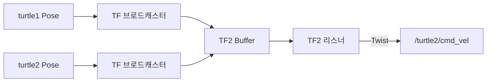

# 23. ROS2 TF2 좌표 변환

### 1. TF2 소개

TF2는 ROS2에서 여러 좌표계 사이의 위치와 자세 관계를 시간에 따라 관리하는 라이브러리입니다. 로봇 시스템에는 지도, 오도메트리, 본체, LiDAR, 카메라 등 많은 좌표계가 있으므로 TF2가 이 관계를 트리로 관리합니다.

`map`은 전역 지도 좌표계, `odom`은 누적 오도메트리 좌표계, `base_link`는 로봇 본체 중심 좌표계입니다. 좌표 변환은 평행 이동과 회전으로 구성되며, TF2가 내부 행렬·쿼터니언 계산을 처리합니다.

### 2. TF2 도구 설치와 TurtleSim 예제

Jazzy에서 TF2 TurtleSim 예제와 도구를 설치합니다.

```bash
sudo apt install ros-jazzy-turtle-tf2-py ros-jazzy-tf2-tools ros-jazzy-rqt-tf-tree
```

TurtleSim TF2 데모와 키보드 제어를 실행합니다.

```bash
ros2 launch turtle_tf2_py turtle_tf2_demo.launch.py
```

```bash
ros2 run turtlesim turtle_teleop_key
```

첫 번째 거북이를 움직이면 두 번째 거북이가 TF 변환을 사용해 따라갑니다.

### 3. TF 트리와 변환 조회

TF 트리를 그래프로 확인합니다.

```bash
ros2 run rqt_tf_tree rqt_tf_tree
```

두 좌표계 사이의 현재 변환은 `tf2_echo`로 확인합니다.

```bash
ros2 run tf2_ros tf2_echo turtle2 turtle1
```

RViz2에서는 Fixed Frame을 `world`로 설정하고 **TF** 디스플레이를 추가하면 움직이는 좌표축을 볼 수 있습니다.

### 4. 정적 좌표 변환

정적 변환은 LiDAR와 `base_link`처럼 상대 위치가 변하지 않는 두 좌표계의 관계입니다.

```bash
ros2 run tf2_ros static_transform_publisher \
  --x 0 --y 0 --z 3 \
  --roll 0 --pitch 0 --yaw 3.14 \
  --frame-id A --child-frame-id B
```

위 명령은 `A`에서 `B`로의 평행 이동 `(0, 0, 3)`과 회전 `(0, 0, 3.14)`을 발행합니다. 다른 터미널에서 확인합니다.

```bash
ros2 run tf2_ros tf2_echo A B
```

### 5. Turtle 따라가기 원리

두 거북이의 좌표계를 `turtle1`, `turtle2`라고 할 때, `turtle2` 좌표계에서 본 `turtle1`의 변환 벡터를 구합니다. 벡터의 길이는 거리, 방향은 회전 각도입니다. 이를 선속도와 각속도로 바꾸어 `/turtle2/cmd_vel`에 발행하면 turtle2가 turtle1을 따라갑니다.



### 6. 동적 TF 브로드캐스터

예제 코드를 저장할 패키지를 만듭니다.

```bash
cd workspace/src
ros2 pkg create pkg_tf --build-type ament_python \
  --dependencies rclpy geometry_msgs tf2_ros turtlesim \
  --node-name turtle_tf_broadcaster
mkdir -p pkg_tf/launch
```

`turtle_tf_broadcaster.py`는 `/turtle1/pose` 또는 `/turtle2/pose`를 구독하고, `world`에서 거북이 좌표계로의 변환을 발행합니다.

```python
import rclpy
import tf_transformations
from geometry_msgs.msg import TransformStamped
from rclpy.node import Node
from tf2_ros import TransformBroadcaster
from turtlesim.msg import Pose


class TurtleTFBroadcaster(Node):
    def __init__(self):
        super().__init__('turtle_tf_broadcaster')
        self.declare_parameter('turtlename', 'turtle1')
        self.name = self.get_parameter('turtlename').value
        self.broadcaster = TransformBroadcaster(self)
        self.create_subscription(Pose, f'/{self.name}/pose', self.callback, 10)

    def callback(self, pose):
        transform = TransformStamped()
        transform.header.stamp = self.get_clock().now().to_msg()
        transform.header.frame_id = 'world'
        transform.child_frame_id = self.name
        transform.transform.translation.x = pose.x
        transform.transform.translation.y = pose.y
        q = tf_transformations.quaternion_from_euler(0, 0, pose.theta)
        transform.transform.rotation.x = q[0]
        transform.transform.rotation.y = q[1]
        transform.transform.rotation.z = q[2]
        transform.transform.rotation.w = q[3]
        self.broadcaster.sendTransform(transform)
```

### 7. TF2 리스너와 속도 제어

리스너는 `Buffer.lookup_transform()`으로 변환을 읽습니다. 각도는 `atan2(y, x)`, 거리는 피타고라스 정리로 계산합니다.

```python
import math

transform = self.tf_buffer.lookup_transform('turtle2', 'turtle1', rclpy.time.Time())
x = transform.transform.translation.x
y = transform.transform.translation.y

msg.angular.z = math.atan2(y, x)
msg.linear.x = 0.5 * math.sqrt(x ** 2 + y ** 2)
self.publisher.publish(msg)
```

### 8. Launch 파일과 실행

Launch 파일은 `turtlesim_node`, turtle1·turtle2 브로드캐스터, TF 리스너를 함께 시작합니다.

```python
Node(package='turtlesim', executable='turtlesim_node'),
Node(package='pkg_tf', executable='turtle_tf_broadcaster', name='broadcaster1', parameters=[{'turtlename': 'turtle1'}]),
Node(package='pkg_tf', executable='turtle_tf_broadcaster', name='broadcaster2', parameters=[{'turtlename': 'turtle2'}]),
Node(package='pkg_tf', executable='turtle_following', name='listener'),
```

`setup.py`에는 두 Python 실행 파일과 Launch 디렉터리를 등록합니다.

```python
entry_points={
    'console_scripts': [
        'turtle_tf_broadcaster = pkg_tf.turtle_tf_broadcaster:main',
        'turtle_following = pkg_tf.turtle_following:main',
    ],
},
data_files=[
    (os.path.join('share', package_name, 'launch'), glob('launch/*')),
],
```

빌드한 뒤 실행합니다.

```bash
colcon build --packages-select pkg_tf
source install/setup.bash
ros2 launch pkg_tf turtle_following.launch.py
```

새 터미널에서 첫 번째 거북이를 제어합니다.

```bash
ros2 run turtlesim turtle_teleop_key
```

### 9. 시간 기반 TF 변환

`tf2_ros.Buffer`는 기본적으로 최근 10초 동안의 변환을 시간순으로 저장합니다. 따라서 과거 시점의 좌표 변환을 조회하거나 서로 다른 시점의 좌표계를 변환할 수 있습니다. 캐시 시간은 `Buffer` 생성 시 조정할 수 있습니다.
