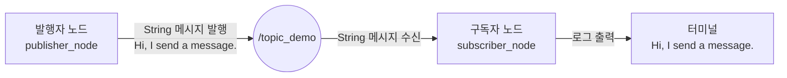

# 7. ROS2 토픽 통신

### 1. 토픽 통신 소개

토픽 통신은 ROS2에서 가장 많이 사용하는 통신 방식입니다. 발행자(publisher)는 지정한 토픽에 데이터를 발행하고, 해당 토픽을 구독한 구독자(subscriber)는 데이터를 받습니다.

토픽 통신은 발행/구독 모델을 사용합니다. 데이터를 보내는 객체를 발행자, 받는 객체를 구독자라고 하며, 각 토픽에는 이름과 고정된 메시지 자료형이 필요합니다.

### 1.1. 토픽 발행과 수신 흐름



발행자는 `/topic_demo`에 `String` 메시지를 발행합니다. 같은 이름과 자료형의 토픽을 구독한 노드는 메시지를 받아 콜백 함수에서 처리합니다.

### 2. 패키지 만들기

작업 영역의 `src` 디렉터리에서 `pkg_topic` 패키지를 만듭니다.

```bash
cd workspace/src
ros2 pkg create pkg_topic --build-type ament_python --dependencies rclpy --node-name publisher_demo
```

위 명령은 `publisher_demo` 노드와 필요한 구성 파일을 함께 생성합니다.

### 3. 발행자 구현

### 3.1. 발행자 만들기

`publisher_demo.py`를 열고 다음 코드를 작성합니다. 이 노드는 1초마다 `/topic_demo` 토픽으로 문자열 메시지를 발행합니다.

```python
import rclpy
from rclpy.node import Node
from std_msgs.msg import String


class TopicPub(Node):
    def __init__(self, name):
        super().__init__(name)
        self.publisher = self.create_publisher(String, '/topic_demo', 1)
        self.timer = self.create_timer(1.0, self.publish_message)

    def publish_message(self):
        msg = String()
        msg.data = 'Hi, I send a message.'
        self.publisher.publish(msg)


def main(args=None):
    rclpy.init(args=args)
    node = TopicPub('publisher_node')
    rclpy.spin(node)
    node.destroy_node()
    rclpy.shutdown()
```

### 3.2. 진입점 구성

`setup.py`의 `entry_points`에 발행자 실행 항목을 추가합니다.

```python
entry_points={
    'console_scripts': [
        'publisher_demo = pkg_topic.publisher_demo:main',
    ],
},
```

### 3.3. 패키지 컴파일 및 실행

작업 영역 최상위 디렉터리에서 패키지를 컴파일하고 환경을 적용합니다.

```bash
colcon build --packages-select pkg_topic
source install/setup.bash
```

발행자 노드를 실행합니다.

```bash
ros2 run pkg_topic publisher_demo
```

다른 터미널에서 현재 발행 중인 토픽을 확인하고 메시지를 출력할 수 있습니다.

```bash
ros2 topic list
ros2 topic echo /topic_demo
```

`Hi, I send a message.` 메시지가 반복해서 표시됩니다.

### 4. 구독자 구현

### 4.1. 구독자 만들기

`publisher_demo.py`와 같은 디렉터리에 `subscriber_demo.py` 파일을 만들고 다음 코드를 작성합니다.

```python
import rclpy
from rclpy.node import Node
from std_msgs.msg import String


class TopicSub(Node):
    def __init__(self, name):
        super().__init__(name)
        self.subscription = self.create_subscription(
            String, '/topic_demo', self.callback, 1
        )

    def callback(self, msg):
        self.get_logger().info(msg.data)


def main(args=None):
    rclpy.init(args=args)
    node = TopicSub('subscriber_node')
    rclpy.spin(node)
    node.destroy_node()
    rclpy.shutdown()
```

### 4.2. 진입점 구성

`setup.py`의 `console_scripts` 목록에 구독자 항목을 추가합니다.

```python
'subscriber_demo = pkg_topic.subscriber_demo:main',
```

### 4.3. 컴파일 및 실행

패키지를 다시 컴파일하고 환경을 적용합니다.

```bash
colcon build --packages-select pkg_topic
source install/setup.bash
```

서로 다른 터미널에서 발행자와 구독자를 실행합니다.

```bash
ros2 run pkg_topic publisher_demo
```

```bash
ros2 run pkg_topic subscriber_demo
```

구독자 터미널에는 발행자가 `/topic_demo`로 보낸 메시지가 출력됩니다.
