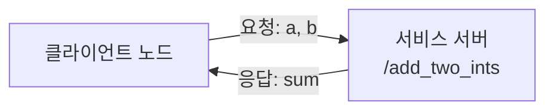

# 8. ROS2 서비스 통신

### 1. 서비스 통신 소개

서비스 통신은 요청/응답 방식입니다. 클라이언트가 서버에 요청을 보내면 서버가 요청을 처리하고 응답을 반환합니다. 필요한 시점에 한 번 요청하고 결과를 받아야 하는 작업에 적합합니다.



### 2. 패키지 만들기

작업 영역의 `src` 디렉터리에서 패키지를 만듭니다.

```bash
cd workspace/src
ros2 pkg create pkg_service --build-type ament_python --dependencies rclpy --node-name server_demo
```

### 3. 서버 구현

### 3.1. 서버 만들기

`server_demo.py`에 다음 코드를 작성합니다. 서버는 `/add_two_ints` 요청의 두 정수를 더해 반환합니다.

```python
import rclpy
from rclpy.node import Node
from example_interfaces.srv import AddTwoInts


class ServiceServer(Node):
    def __init__(self, name):
        super().__init__(name)
        self.service = self.create_service(
            AddTwoInts, '/add_two_ints', self.add_callback
        )

    def add_callback(self, request, response):
        response.sum = request.a + request.b
        self.get_logger().info(f'response.sum = {response.sum}')
        return response


def main(args=None):
    rclpy.init(args=args)
    node = ServiceServer('server_node')
    rclpy.spin(node)
    node.destroy_node()
    rclpy.shutdown()
```

`AddTwoInts` 서비스의 요청과 응답 자료형은 다음 명령으로 확인할 수 있습니다.

```bash
ros2 interface show example_interfaces/srv/AddTwoInts
```

`---` 위쪽은 요청(`int64 a`, `int64 b`)이고 아래쪽은 응답(`int64 sum`)입니다.

### 3.2. 진입점 구성

`setup.py`의 `console_scripts`에 서버를 추가합니다.

```python
'server_demo = pkg_service.server_demo:main',
```

### 3.3. 서버 컴파일 및 테스트

```bash
colcon build --packages-select pkg_service
source install/setup.bash
ros2 run pkg_service server_demo
```

다른 터미널에서 서비스를 확인하고 `1 + 4` 요청을 보냅니다.

```bash
ros2 service list
ros2 service call /add_two_ints example_interfaces/srv/AddTwoInts "{a: 1, b: 4}"
```

응답으로 `sum: 5`가 표시되고 서버 터미널에도 결과가 기록됩니다.

### 4. 클라이언트 구현

### 4.1. 클라이언트 만들기

`server_demo.py`와 같은 디렉터리에 `client_demo.py`를 만들고 다음 코드를 작성합니다.

```python
import rclpy
from rclpy.node import Node
from example_interfaces.srv import AddTwoInts


class ServiceClient(Node):
    def __init__(self, name):
        super().__init__(name)
        self.client = self.create_client(AddTwoInts, '/add_two_ints')
        while not self.client.wait_for_service(timeout_sec=1.0):
            self.get_logger().info('서비스를 기다리는 중입니다...')
        self.request = AddTwoInts.Request()

    def send_request(self):
        self.request.a = 10
        self.request.b = 90
        return self.client.call_async(self.request)


def main(args=None):
    rclpy.init(args=args)
    node = ServiceClient('client_node')
    future = node.send_request()
    rclpy.spin_until_future_complete(node, future)
    try:
        response = future.result()
        node.get_logger().info(f'Result = {response.sum}')
    finally:
        node.destroy_node()
        rclpy.shutdown()
```

### 4.2. 진입점 구성

`setup.py`의 `console_scripts` 목록에 클라이언트를 추가합니다.

```python
'client_demo = pkg_service.client_demo:main',
```

### 4.3. 컴파일 및 실행

```bash
colcon build --packages-select pkg_service
source install/setup.bash
```

먼저 서버를 실행한 뒤 별도 터미널에서 클라이언트를 실행합니다.

```bash
ros2 run pkg_service server_demo
```

```bash
ros2 run pkg_service client_demo
```

클라이언트는 `a=10`, `b=90`을 요청하고 서버는 합계 `100`을 반환합니다.
