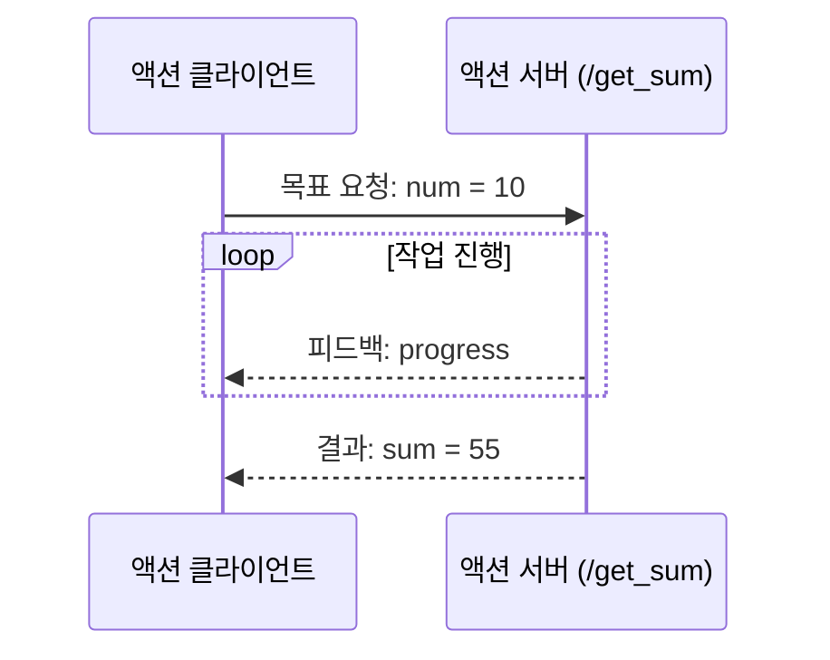

# 9. ROS2 액션 통신

### 1. 액션 통신 소개

액션 통신은 요청/응답 통신에 **진행 피드백**을 더한 방식입니다. 클라이언트가 목표를 보내면 서버는 작업 중 진행 상태를 계속 알리고, 완료 시 최종 결과를 반환합니다.



### 2. 예제 소개

클라이언트가 정수 `N`을 요청하면 서버는 `1`부터 `N`까지 더합니다. 서버는 매 덧셈마다 진행률을 피드백으로 보내고, 계산이 끝나면 합계를 결과로 반환합니다.

### 3. 액션 인터페이스와 패키지 만들기

### 3.1. 액션 인터페이스 패키지 만들기

작업 영역의 `src` 디렉터리에서 인터페이스 패키지를 만듭니다.

```bash
cd workspace/src
ros2 pkg create --build-type ament_cmake pkg_interfaces
mkdir -p pkg_interfaces/action
```

`pkg_interfaces/action/Progress.action` 파일을 만들고 목표, 결과, 피드백을 정의합니다.

```action
int64 num
---
int64 sum
---
float64 progress
```

`package.xml`에 다음 의존성을 추가합니다.

```xml
<buildtool_depend>rosidl_default_generators</buildtool_depend>
<exec_depend>rosidl_default_runtime</exec_depend>
<depend>action_msgs</depend>
<member_of_group>rosidl_interface_packages</member_of_group>
```

`CMakeLists.txt`에 인터페이스 생성 설정을 추가합니다.

```cmake
find_package(rosidl_default_generators REQUIRED)

rosidl_generate_interfaces(${PROJECT_NAME}
  "action/Progress.action"
)
```

인터페이스 패키지를 컴파일하고 확인합니다.

```bash
colcon build --packages-select pkg_interfaces
source install/setup.bash
ros2 interface show pkg_interfaces/action/Progress
```

### 3.2. 액션 패키지 만들기

```bash
ros2 pkg create pkg_action --build-type ament_python --dependencies rclpy pkg_interfaces --node-name action_server_demo
```

### 4. 액션 서버 구현

`action_server_demo.py`에 다음 코드를 작성합니다.

```python
import time
import rclpy
from rclpy.action import ActionServer
from rclpy.node import Node
from pkg_interfaces.action import Progress


class ActionServerNode(Node):
    def __init__(self):
        super().__init__('progress_action_server')
        self.server = ActionServer(self, Progress, 'get_sum', self.execute_callback)

    def execute_callback(self, goal_handle):
        feedback = Progress.Feedback()
        total = 0
        for value in range(1, goal_handle.request.num + 1):
            total += value
            feedback.progress = value / goal_handle.request.num
            goal_handle.publish_feedback(feedback)
            time.sleep(1)
        goal_handle.succeed()
        result = Progress.Result()
        result.sum = total
        return result


def main(args=None):
    rclpy.init(args=args)
    node = ActionServerNode()
    rclpy.spin(node)
    node.destroy_node()
    rclpy.shutdown()
```

`setup.py`의 `console_scripts`에 서버 진입점을 추가합니다.

```python
'action_server_demo = pkg_action.action_server_demo:main',
```

컴파일한 뒤 서버를 실행하고, 다른 터미널에서 목표를 전송합니다.

```bash
colcon build --packages-select pkg_action
source install/setup.bash
ros2 run pkg_action action_server_demo
```

```bash
ros2 action list
ros2 action send_goal /get_sum pkg_interfaces/action/Progress "{num: 10}" --feedback
```

### 5. 액션 클라이언트 구현

`action_client_demo.py`에 다음 코드를 작성합니다.

```python
import rclpy
from rclpy.action import ActionClient
from rclpy.node import Node
from pkg_interfaces.action import Progress


class ActionClientNode(Node):
    def __init__(self):
        super().__init__('progress_action_client')
        self.client = ActionClient(self, Progress, 'get_sum')

    def send_goal(self, num):
        goal = Progress.Goal()
        goal.num = num
        self.client.wait_for_server()
        future = self.client.send_goal_async(goal, feedback_callback=self.feedback_callback)
        future.add_done_callback(self.goal_response_callback)

    def goal_response_callback(self, future):
        goal_handle = future.result()
        if not goal_handle.accepted:
            self.get_logger().info('목표 요청이 거부되었습니다.')
            return
        goal_handle.get_result_async().add_done_callback(self.result_callback)

    def feedback_callback(self, feedback_msg):
        progress = feedback_msg.feedback.progress * 100
        self.get_logger().info(f'진행률: {progress:.0f}%')

    def result_callback(self, future):
        self.get_logger().info(f'최종 결과: {future.result().result.sum}')
        rclpy.shutdown()


def main(args=None):
    rclpy.init(args=args)
    node = ActionClientNode()
    node.send_goal(10)
    rclpy.spin(node)
```

`setup.py`에 클라이언트 진입점을 추가하고 실행합니다.

```python
'action_client_demo = pkg_action.action_client_demo:main',
```

```bash
colcon build --packages-select pkg_action
source install/setup.bash
ros2 run pkg_action action_server_demo
```

별도 터미널에서 클라이언트를 실행합니다.

```bash
ros2 run pkg_action action_client_demo
```

클라이언트에는 진행률이 계속 표시되고, 계산이 끝나면 `1`부터 `10`까지의 합계인 `55`가 출력됩니다.
