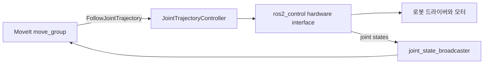

# MoveIt 2 설치와 사용법 (ROS 2 Jazzy)

이 문서는 이 작업공간의 기준 환경인 **Ubuntu 24.04 / ROS 2 Jazzy**에서
MoveIt 2를 설치하고, 가상 로봇으로 동작을 확인한 뒤 자체 로봇에 적용하는
절차를 설명한다.

MoveIt 2는 로봇팔의 역기구학(IK), 충돌 검사, 경로 계획, 궤적 실행을 맡는다.
실제 모터 제어는 `ros2_control`과 그 하드웨어 드라이버가 맡으며, MoveIt은
`FollowJointTrajectory` 액션으로 계획한 궤적을 컨트롤러에 전달한다.

## 1. 사전 조건

ROS 2 Jazzy가 설치되어 있어야 한다. 이 작업공간에서는 루트에서 아래 파일을
source하면 ROS 2와 빌드된 작업공간을 함께 설정한다.

```bash
cd /home/hjpark/CLionProjects/ros2_dev
source scripts/setup_ros2.sh
```

ROS 2가 아직 없다면 먼저 다음 스크립트를 실행한다.

```bash
./bootstrap_ros2_jazzy.sh
```

새 터미널을 열어 위 `source` 명령을 다시 실행한다.

## 2. MoveIt 2 설치

```bash
sudo apt update
sudo apt install ros-jazzy-moveit \
  ros-jazzy-moveit-resources-panda-moveit-config
```

설치 결과를 확인한다.

```bash
source /opt/ros/jazzy/setup.bash
ros2 pkg list | rg '^moveit'
ros2 pkg prefix moveit_setup_assistant
```

`moveit_setup_assistant`의 경로가 출력되면 기본 설치가 완료된 것이다.

## 3. Panda 가상 로봇으로 확인

패키지에 포함된 Panda 설정을 실행한다.

```bash
source /opt/ros/jazzy/setup.bash
ros2 launch moveit_resources_panda_moveit_config demo.launch.py
```

RViz가 열리면 다음 순서로 확인한다.

1. 좌측 **Motion Planning** 패널에서 Planning Group을 `panda_arm`으로 선택한다.
2. **Goal State**에서 목표 자세를 선택하거나 Interactive Marker를 드래그한다.
3. **Plan**을 눌러 충돌 없는 경로가 만들어지는지 확인한다.
4. 가상 컨트롤러에서 궤적을 재생하려면 **Execute**를 누른다.

이 단계는 실제 모터를 움직이지 않는다. RViz, `move_group`, 가짜 컨트롤러가
같이 실행되어 로봇 모델과 경로 계획만 검증한다.

## 4. 내 로봇용 MoveIt 설정 패키지 생성

### 준비물

- 링크와 조인트를 정의한 URDF 또는 xacro
- 모든 조인트의 이름, 축, 제한값(position/velocity/effort)
- 베이스 프레임과 TCP(툴 중심점) 링크 이름
- 그리퍼가 있다면 그리퍼 조인트와 끝단 링크 이름

URDF가 xacro라면 먼저 전개해 URDF를 만든다. 패키지 내 xacro의 예시는 다음과 같다.

```bash
source scripts/setup_ros2.sh
ros2 run xacro xacro src/<robot_description_pkg>/urdf/<robot>.urdf.xacro \
  > /tmp/<robot>.urdf
```

설정 도우미를 연다.

```bash
source scripts/setup_ros2.sh
ros2 launch moveit_setup_assistant setup_assistant.launch.py
```

도우미에서 다음을 차례로 설정한다.

1. **Create New MoveIt Configuration Package**를 선택하고 URDF를 불러온다.
2. **Self-Collisions**에서 충돌 행렬을 생성한다.
3. **Virtual Joints**에서 로봇 베이스가 월드에 고정인지, 이동 가능한지 지정한다.
4. **Planning Groups**에서 팔 조인트 체인을 추가한다. 일반적으로 solver는 KDL로 시작한다.
5. **End Effectors**에서 그리퍼와 TCP 링크를 등록한다.
6. **ROS 2 Controllers**에서 팔에 `joint_trajectory_controller/JointTrajectoryController`를
   연결한다.
7. **MoveIt Controllers**에서 같은 이름의 `FollowJointTrajectory` 컨트롤러를 추가한다.
8. 작업공간의 `src/<robot>_moveit_config`에 패키지를 생성한다.

생성 패키지를 빌드하고 데모를 실행한다.

```bash
cd /home/hjpark/CLionProjects/ros2_dev
rosdep install --from-paths src --ignore-src -r -y
colcon build --packages-select <robot>_moveit_config --symlink-install
source scripts/setup_ros2.sh
ros2 launch <robot>_moveit_config demo.launch.py
```

`<robot>`은 실제 로봇의 MoveIt 설정 패키지 이름을 넣는 자리표시자다. Setup
Assistant가 `my_arm_moveit_config` 패키지를 만들었다면 다음처럼 바꾼다.

```bash
colcon build --packages-select my_arm_moveit_config --symlink-install
ros2 launch my_arm_moveit_config demo.launch.py
```

Panda 예제에는 이미 정해진 패키지 이름을 사용한다.

```bash
ros2 launch moveit_resources_panda_moveit_config demo.launch.py
```

## 5. 실제 하드웨어 연결

실제 구동에는 로봇 설명 패키지, `ros2_control` 하드웨어 드라이버,
`controller_manager`, 그리고 MoveIt 설정 패키지가 필요하다.



다음 항목은 반드시 서로 일치해야 한다.

| 항목 | 일치시킬 위치 |
| --- | --- |
| 조인트 이름과 순서 | URDF, `ros2_controllers.yaml`, MoveIt controller 설정 |
| 컨트롤러 이름 | `ros2_controllers.yaml`, `moveit_controllers.yaml` |
| 팔 컨트롤러 인터페이스 | `FollowJointTrajectory` 액션 |
| 현재 관절 상태 | `joint_state_broadcaster`가 발행하는 `/joint_states` |
| 기준 프레임과 TCP | URDF/SRDF, RViz Motion Planning 설정 |

안전을 위해 실제 로봇 연결 전에는 저속 제한을 설정하고, 장애물이 없는 상태에서
RViz 계획 결과와 현재 조인트 상태가 일치하는지 먼저 확인한다.

컨트롤러가 올라왔는지 확인하는 명령은 다음과 같다.

```bash
source scripts/setup_ros2.sh
ros2 control list_controllers
ros2 topic echo /joint_states --once
ros2 action list | rg 'follow_joint_trajectory'
```

팔 컨트롤러는 `active`여야 하며, `/joint_states`에는 URDF의 조인트 이름과 현재
위치가 있어야 한다.

## 6. C++에서 계획하고 실행하기

MoveIt 설정을 실행한 상태에서 `MoveGroupInterface`로 계획을 요청할 수 있다.
핵심 흐름은 Planning Group 선택 → 목표 자세 지정 → 계획 → 실행이다.

```cpp
#include <memory>
#include <rclcpp/rclcpp.hpp>
#include <moveit/move_group_interface/move_group_interface.h>

auto node = rclcpp::Node::make_shared("arm_motion_client");
moveit::planning_interface::MoveGroupInterface arm(node, "arm");

arm.setPoseTarget(target_pose, "tool0");
moveit::planning_interface::MoveGroupInterface::Plan plan;
const bool planned = static_cast<bool>(arm.plan(plan));
if (planned) {
  arm.execute(plan);
}
```

`"arm"`과 `"tool0"`은 Setup Assistant에서 만든 Planning Group과 TCP 링크 이름으로
바꾼다. 노드의 executor를 실행하는 코드는 실제 애플리케이션 구조에 맞춰 추가한다.

## 7. 자주 발생하는 문제

| 증상 | 확인할 내용 |
| --- | --- |
| `Package ... not found` | 새 터미널에서 `source /opt/ros/jazzy/setup.bash`와 `source install/setup.bash`를 실행했는지 확인한다. |
| 계획은 되지만 Execute가 실패 | MoveIt과 `ros2_control`의 컨트롤러 이름, 조인트 목록, `FollowJointTrajectory` 액션을 확인한다. |
| RViz에서 로봇이 움직이지 않음 | `/joint_states`, `robot_state_publisher`, TF의 베이스 프레임을 확인한다. |
| IK 해를 찾지 못함 | 목표가 작업 공간 안에 있는지, TCP 링크와 Planning Group이 맞는지, 조인트 제한이 올바른지 확인한다. |
| 충돌 때문에 계획 실패 | Self-collision matrix를 다시 만들고, Planning Scene의 장애물·프레임 위치를 확인한다. |

### Ubuntu 24.04: `libsdformat14.so.14`를 찾지 못해 `move_group`이 종료되는 경우

다음과 비슷한 오류가 나타날 수 있다.

```text
Failed to load library /opt/ros/jazzy/lib/libsdformat_urdf_plugin.so
Could not load library dlopen error: libsdformat14.so.14:
cannot open shared object file: No such file or directory
```

이 오류는 MoveIt 설정 자체의 오류가 아니다. `move_group`과
`robot_state_publisher`가 SDFormat URDF 파서 플러그인을 불러올 때 필요한
`libsdformat14.so.14` 런타임 라이브러리가 없는 경우 발생한다. Jazzy는
SDFormat 14를 사용하며, 해당 라이브러리는 Gazebo 공식 APT 저장소에서 제공된다.

먼저 누락 여부를 확인한다.

```bash
ldconfig -p | rg 'libsdformat14\.so\.14'
ldd /opt/ros/jazzy/lib/libsdformat_urdf_plugin.so | rg 'sdformat|not found'
```

첫 명령에 라이브러리 경로가 없거나, 두 번째 명령에 `not found`가 보이면 다음으로
Gazebo 공식 저장소를 추가하고 라이브러리와 ROS 플러그인을 다시 설치한다.

```bash
sudo apt update
sudo apt install -y curl lsb-release gnupg

sudo curl -fsSL https://packages.osrfoundation.org/gazebo.gpg \
  -o /usr/share/keyrings/pkgs-osrf-archive-keyring.gpg

echo "deb [arch=$(dpkg --print-architecture) signed-by=/usr/share/keyrings/pkgs-osrf-archive-keyring.gpg] https://packages.osrfoundation.org/gazebo/ubuntu-stable $(lsb_release -cs) main" \
  | sudo tee /etc/apt/sources.list.d/gazebo-stable.list > /dev/null

sudo apt update
sudo apt install -y libsdformat14
sudo apt install --reinstall ros-jazzy-sdformat-urdf
sudo ldconfig
```

설치 뒤 위의 `ldconfig` 및 `ldd` 명령을 다시 실행해 `not found`가 없어졌는지
확인한다. 새 터미널에서 ROS 환경을 다시 설정한 후 launch 파일을 실행한다.

```bash
source /opt/ros/jazzy/setup.bash
source /home/hjpark/CLionProjects/ros2_dev/install/setup.bash
ros2 launch <robot>_moveit_config demo.launch.py
```

아래 로그는 원인이 아니며, 라이브러리 복구 후 별도로 대응할 수 있다.

- `static_transform_publisher`의 old-style arguments 경고: 최신 인자 형식으로의 전환 권고
- `Could not enable FIFO RT scheduling policy`: 실시간 우선순위 권한이 없다는 경고
- RViz의 `/recognize_objects not available`: 물체 인식 서버를 실행하지 않은 경우의 정보성 오류

## 참고 자료

- [MoveIt 공식 Getting Started](https://moveit.picknik.ai/main/doc/tutorials/getting_started/getting_started.html)
- [MoveIt Setup Assistant](https://moveit.picknik.ai/main/doc/examples/setup_assistant/setup_assistant_tutorial.html)
- [RViz에서 MoveIt Quickstart](https://moveit.picknik.ai/main/doc/tutorials/quickstart_in_rviz/quickstart_in_rviz_tutorial.html)
- [ROS 2 Jazzy MoveIt Panda 리소스 패키지](https://index.ros.org/r/moveit_resources/)
- [Gazebo Harmonic Ubuntu 설치](https://gazebosim.org/docs/harmonic/install_ubuntu/)
