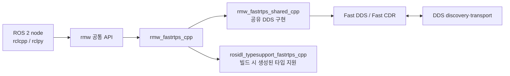

# `rmw_fastrtps_cpp` 분석

> 분석 대상: [`rmw_fastrtps_cpp` — ROS 2 Rolling API](https://docs.ros.org/en/ros2_packages/rolling/api/rmw_fastrtps_cpp/)
>
> 기준 확인일: 2026-09-11. API 페이지의 패키지 README와, 그 README가 연결하는 [Rolling 브랜치 원본](https://github.com/ros2/rmw_fastrtps/tree/rolling)을 함께 확인했다.

## 1. 무엇을 하는 패키지인가

`rmw_fastrtps_cpp`는 ROS 2의 공통 RMW(Robot Middleware) 인터페이스를 [eProsima Fast DDS](https://fast-dds.docs.eprosima.com/)에 연결하는 C++ 구현이다. 애플리케이션이 `rclcpp` 또는 `rclpy`로 publisher, subscription, service, client를 만들면, 이 패키지는 ROS 메시지 타입·QoS·그래프 정보를 Fast DDS의 DDS entity와 설정으로 변환한다.



따라서 일반 ROS 2 node 코드는 이 패키지의 API를 직접 호출할 필요가 없다. 패키지 선택, QoS와 Fast DDS의 고급 설정이 사용자가 주로 다루는 지점이다.

## 2. 정적 타입 지원 구현이라는 의미

이 저장소에는 Fast DDS 기반 RMW가 둘 있다.

| 구현 | 직렬화·역직렬화 타입 정보 | 적합한 의미 |
| --- | --- | --- |
| `rmw_fastrtps_cpp` | 메시지별 매핑을 **빌드 시** 생성하는 Fast RTPS C++ typesupport | 보통의 컴파일된 ROS 2 C++/Python 애플리케이션. 기본 RMW |
| `rmw_fastrtps_dynamic_cpp` | introspection typesupport를 **실행 시** 사용해 방식을 결정 | 런타임 타입 반영이 필요한 경우 |

`rmw_fastrtps_shared_cpp`는 두 구현이 함께 쓰는 코드이며, 독립 RMW 구현이 아니다. `rmw_fastrtps_cpp`의 패키지 설명도 “C++ 정적 코드 생성”을 명시한다. CMake 설정은 `fastdds` 3, `fastcdr` 2 및 `rosidl_typesupport_fastrtps_cpp`에 연결하며, ROS RMW 구현으로 C/C++ Fast RTPS typesupport 조합을 등록한다. [CMakeLists.txt](https://github.com/ros2/rmw_fastrtps/blob/rolling/rmw_fastrtps_cpp/CMakeLists.txt), [package.xml](https://github.com/ros2/rmw_fastrtps/blob/rolling/rmw_fastrtps_cpp/package.xml)

## 3. 선택과 기본 동작

Rolling 문서는 `rmw_fastrtps_cpp`를 ROS 2의 기본 RMW라고 설명한다. 실행 시 명시하려면 아래처럼 설정한다.

```bash
export RMW_IMPLEMENTATION=rmw_fastrtps_cpp
ros2 run <패키지> <실행파일>
```

한 번의 실행에만 적용할 수도 있다.

```bash
RMW_IMPLEMENTATION=rmw_fastrtps_cpp ros2 run <패키지> <실행파일>
```

이 워크스페이스는 Jazzy를 대상으로 하므로 실제 설치 버전과 Rolling의 패키지 버전·Fast DDS 의존성은 다를 수 있다. 현재 설치에서 선택 가능한 구현은 `ros2 doctor --report` 또는 `echo $RMW_IMPLEMENTATION`과 설치 패키지 목록으로 확인하는 편이 안전하다. Fast DDS RMW 설치·소스 빌드 절차는 [공식 Fast DDS RMW 안내](https://docs.ros.org/en/rolling/Installation/RMW-Implementations/DDS-Implementations/Working-with-eProsima-Fast-DDS.html)를 따른다.

## 4. 기본값과 설정 우선순위

원본 README 기준으로 RMW가 별도 XML 설정 없이 정하는 Fast DDS 관련 기본값은 다음과 같다.

| 항목 | 기본값 | 실무적 영향 |
| --- | --- | --- |
| history memory policy | `PREALLOCATED_WITH_REALLOC_MEMORY_MODE` | history 공간을 미리 쓰되 필요하면 확장 |
| publication mode | `SYNCHRONOUS_PUBLISH_MODE` | `publish()` 호출 스레드가 전송 경로를 수행할 수 있음 |
| Data Sharing | `OFF` | 같은 호스트라도 zero-copy Data Sharing은 기본으로 켜지지 않음 |
| 호스트 내부 전송 | Shared Memory Transport 사용 | 프로세스 간 로컬 통신을 가속할 수 있음 |
| 호스트 간 전송 | UDPv4 등 네트워크 transport 사용 | discovery와 데이터 전송은 네트워크 조건의 영향을 받음 |

ROS 2 QoS는 우선적으로 `rmw_qos_profile_t`의 값이 적용된다. 단, 해당 필드가 `*_SYSTEM_DEFAULT`이면 XML 값이 사용되고, XML에도 없으면 Fast DDS 기본값으로 떨어진다. `RMW_FASTRTPS_USE_QOS_FROM_XML=1`은 history memory policy와 publication mode를 XML에 맡기도록 한다. 이 값을 켠 뒤 XML에 두 항목을 빼면 **RMW 기본값이 아니라 Fast DDS 기본값**이 적용된다. 그 차이가 설정 사고의 가장 흔한 원인이다.

| `RMW_FASTRTPS_USE_QOS_FROM_XML` | 일반 QoS가 `SYSTEM_DEFAULT`인가 | 일반 QoS의 값 | history/publication mode |
| --- | --- | --- | --- |
| `0` (기본) | 아니오 | RMW QoS | RMW 기본값 |
| `0` (기본) | 예 | XML, 없으면 Fast DDS 기본값 | RMW 기본값 |
| `1` | 아니오 | RMW QoS | XML, 없으면 Fast DDS 기본값 |
| `1` | 예 | XML, 없으면 Fast DDS 기본값 | XML, 없으면 Fast DDS 기본값 |

관련 원문: [repository README — Full QoS configuration](https://github.com/ros2/rmw_fastrtps/blob/rolling/README.md#full-qos-configuration), [Fast DDS XML configuration](https://fast-dds.docs.eprosima.com/en/latest/fastdds/xml_configuration/xml_configuration.html).

## 5. 자주 쓰는 환경 변수

| 변수 | 값 / 용도 | 주의점 |
| --- | --- | --- |
| `RMW_IMPLEMENTATION` | `rmw_fastrtps_cpp` 선택 | node를 시작하기 전에 설정 |
| `RMW_FASTRTPS_PUBLICATION_MODE` | `SYNCHRONOUS`, `ASYNCHRONOUS`, `AUTO` | XML QoS 사용 모드가 켜져 있으면 XML 설정이 우선 |
| `RMW_FASTRTPS_USE_QOS_FROM_XML` | `1`이면 XML이 history/publication mode 제어 | XML에서 누락한 값은 Fast DDS 기본값으로 변경될 수 있음 |
| `FASTDDS_DEFAULT_PROFILES_FILE` | 적용할 Fast DDS XML 파일 경로 | 또는 실행 디렉터리의 `DEFAULT_FASTDDS_PROFILES.xml` 사용 |
| `ROS_AUTOMATIC_DISCOVERY_RANGE` | ROS 2 discovery 범위 지정 | 완전한 XML discovery 구성을 쓸 때 `SYSTEM_DEFAULT`로 두어 ROS 전용 변수가 간섭하지 않게 함 |
| `ROS_STATIC_PEERS` | 정적 peer 지정 | 위와 같은 discovery 우선순위에 유의 |
| `FASTDDS_BUILTIN_TRANSPORTS` | `LARGE_DATA`로 TCP 기반 대용량 전송 활성화 | publisher와 subscription 양쪽에 설정 |

동기 발행은 호출 스레드에서 직접 전송하므로 낮은 지연과 높은 처리량에 유리할 수 있지만, 전송이 막히면 사용자 스레드도 막힐 수 있다. 비동기 발행은 큐에 복사하고 백그라운드 스레드가 보내므로 호출자는 빨리 돌아오지만 큐잉·스케줄링 비용이 추가된다. `AUTO`는 XML 값, 없으면 Fast DDS 기본값을 쓴다.

## 6. XML profile 적용 방식

XML은 기본 profile 하나만 둘 수도 있고, endpoint마다 profile을 둘 수도 있다. publisher/subscription은 최종 ROS topic 이름(항상 `/`로 시작)을 `profile_name`으로 찾고, 없으면 `is_default_profile="true"` profile을 쓴다. 예를 들어 node namespace가 `/robot_1`이고 topic이 `scan`이면 profile 이름은 `/robot_1/scan`이다. 이미 `/scan`처럼 완전 수식된 이름을 썼다면 namespace는 앞에 붙지 않는다.

service와 client는 요청·응답이 각각 DDS endpoint이므로 mangling된 topic 이름을 먼저 찾는다. 없으면 service의 경우 `service`, client의 경우 `client`, 마지막으로 default profile 순으로 찾는다. 상세 매핑과 전체 XML 예시는 [repository README](https://github.com/ros2/rmw_fastrtps/blob/rolling/README.md#applying-different-profiles-to-different-entities)에 있다.

간단한 실행 예시는 다음과 같다.

```bash
export RMW_IMPLEMENTATION=rmw_fastrtps_cpp
export RMW_FASTRTPS_USE_QOS_FROM_XML=1
export FASTDDS_DEFAULT_PROFILES_FILE=/absolute/path/fastdds_profiles.xml
ros2 run demo_nodes_cpp talker
```

실제 적용 QoS는 RMW API의 `rmw_publisher_get_actual_qos()` 또는 rclcpp/rclpy에서 제공하는 해당 entity QoS 조회 기능으로 검증해야 한다. XML 파일이 존재한다는 사실만으로 원하는 profile이 선택됐다고 판단하면 안 된다.

## 7. 로컬 성능: Shared Memory, loaned message, Data Sharing

세 기능은 같은 뜻이 아니다.

| 기능 | 역할 | 기본 상태 |
| --- | --- | --- |
| Shared Memory Transport | 동일 호스트의 DDS transport를 공유 메모리로 운반 | 사용 |
| Loaned Messages | 애플리케이션과 RMW 사이 메시지 메모리 복사를 줄이는 ROS API | 타입·RMW 지원 조건 필요 |
| Data Sharing | Fast DDS writer/reader가 같은 호스트에서 데이터를 공유하도록 하는 delivery 방식 | `OFF` |

완전한 zero-copy delivery를 목표로 한다면 Loaned Messages API를 사용하고, XML의 publisher와 subscriber QoS에 `<data_sharing><kind>AUTOMATIC</kind></data_sharing>`를 넣은 뒤 `RMW_FASTRTPS_USE_QOS_FROM_XML=1`을 설정한다. Iron 이후 문서는 loaned message에 POD(Plain Old Data) 타입이 필요하다고 설명한다. 따라서 임의의 복잡한 ROS 메시지가 자동으로 zero-copy가 된다고 가정해서는 안 되며, target ROS 배포판과 메시지 타입에서 실제로 측정·검증해야 한다. [원문 zero-copy 안내](https://github.com/ros2/rmw_fastrtps/blob/rolling/README.md#enable-zero-copy-data-sharing), [ROS 2 loaned message 설계](https://design.ros2.org/articles/zero_copy.html)

## 8. 네트워크와 discovery

participant discovery는 `ROS_AUTOMATIC_DISCOVERY_RANGE`, `ROS_STATIC_PEERS`로 제어할 수 있다. 사이트 간·격리망·다중 NIC처럼 discovery를 세밀하게 제어해야 하면 Fast DDS XML에서 설정할 수 있지만, 이 경우 ROS 전용 discovery 변수를 `ROS_AUTOMATIC_DISCOVERY_RANGE=SYSTEM_DEFAULT`로 비활성화해 두 설정 계층이 충돌하지 않도록 한다. [Improved Dynamic Discovery](https://docs.ros.org/en/rolling/Tutorials/Advanced/Improved-Dynamic-Discovery.html)

손실이 있는 네트워크에서 큰 메시지를 보내야 할 때는 양쪽 process에 다음을 설정할 수 있다.

```bash
export FASTDDS_BUILTIN_TRANSPORTS=LARGE_DATA
```

`LARGE_DATA`는 데이터 전송에 TCP transport를 추가하고 UDP는 discovery 초기 단계에 제한적으로 사용한다. UDP의 낮은 지연 특성보다 TCP의 신뢰성·흐름 제어가 더 적합한 경우를 위한 선택이다. [Fast DDS transport 환경 변수](https://fast-dds.docs.eprosima.com/en/latest/fastdds/env_vars/env_vars.html#fastdds-builtin-transports)

## 9. 공개 API와 패키지 성숙도

생성된 C++ API에는 `MessageTypeSupport`, `RequestTypeSupport`, `ResponseTypeSupport`, `ServiceTypeSupport`, `TypeSupport`와 Fast DDS의 participant, datawriter, datareader를 얻는 함수가 공개된다. 이는 통합 구현·고급 진단에서 의미가 있지만, 보통의 ROS application은 `rclcpp`/`rclpy` 인터페이스를 사용해야 RMW 교체 가능성을 보존할 수 있다. [생성 C++ API](https://docs.ros.org/en/ros2_packages/rolling/api/rmw_fastrtps_cpp/generated/index.html)

패키지는 [REP-2004](https://www.ros.org/reps/rep-2004.html) 기준 Quality Level 2를 선언한다. 선언에는 배포판 내 API/ABI 안정성, PR peer review·CI, tier 1 플랫폼 검증, lint/static analysis, ROS 상위 계층의 통합·시스템 테스트가 포함된다. 반면 자체 성능 테스트는 없다고 명시한다. 즉, 기능과 품질 절차의 성숙도를 뜻하며 특정 워크로드의 지연·처리량을 보장하지는 않는다. [Quality Declaration](https://github.com/ros2/rmw_fastrtps/blob/rolling/rmw_fastrtps_cpp/QUALITY_DECLARATION.md)

## 10. 적용 판단 체크리스트

1. 기본 동작이면 `rmw_fastrtps_cpp`를 그대로 사용하고 ROS 2 QoS부터 명확히 정한다.
2. XML을 도입할 때는 `RMW_FASTRTPS_USE_QOS_FROM_XML=1`로 인해 Fast DDS 기본값이 새로 적용되는 누락 항목이 없는지 확인한다.
3. topic별 XML profile 이름은 최종 FQN topic 이름과 일치시킨다.
4. 느린 발행 호출이 문제면 `ASYNCHRONOUS`를 검토하고, 처리량·지연·메모리 사용량을 목표 환경에서 비교한다.
5. 같은 호스트 성능은 Shared Memory Transport와 zero-copy를 구분해 측정한다. zero-copy에는 Data Sharing 설정과 Loaned Messages 조건이 추가된다.
6. 손실 네트워크의 대용량 데이터는 양쪽에 `LARGE_DATA`를 설정해 TCP transport를 시험한다.
7. 배포 환경이 Jazzy이면 Rolling 문서의 최신 기능이나 버전 요구를 그대로 전제하지 말고, 설치된 `rmw_fastrtps_cpp`와 Fast DDS 버전을 먼저 확인한다.

## 참고 원문

- [ROS 2 Rolling `rmw_fastrtps_cpp` API 문서](https://docs.ros.org/en/ros2_packages/rolling/api/rmw_fastrtps_cpp/)
- [rmw_fastrtps Rolling README](https://github.com/ros2/rmw_fastrtps/blob/rolling/README.md): 동작, QoS/XML, discovery, zero-copy, transport 설정의 주된 출처
- [`rmw_fastrtps_cpp` README](https://github.com/ros2/rmw_fastrtps/blob/rolling/rmw_fastrtps_cpp/README.md): 정적 C++ typesupport와 Quality Level 2 선언
- [`package.xml`](https://github.com/ros2/rmw_fastrtps/blob/rolling/rmw_fastrtps_cpp/package.xml) 및 [`CMakeLists.txt`](https://github.com/ros2/rmw_fastrtps/blob/rolling/rmw_fastrtps_cpp/CMakeLists.txt): 의존성·빌드·등록 방식
- [ROS 2 Fast DDS 사용 안내](https://docs.ros.org/en/rolling/Installation/RMW-Implementations/DDS-Implementations/Working-with-eProsima-Fast-DDS.html)
