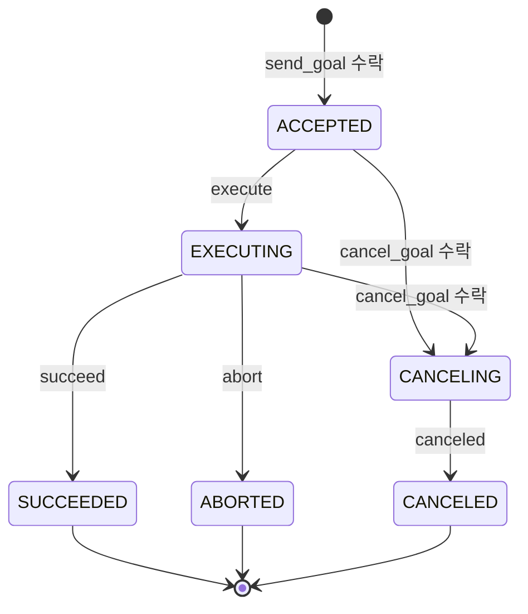
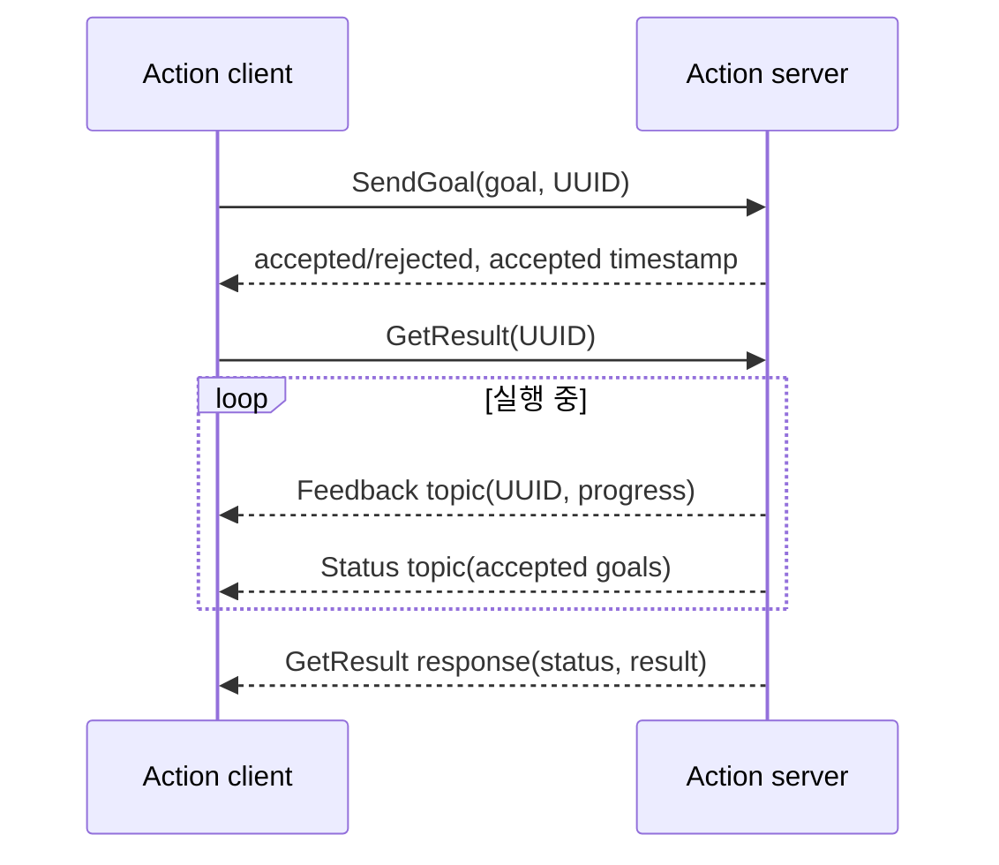

# ROS 2 Actions 설계 분석

> 분석 대상: [ROS 2 Design: Actions](https://design.ros2.org/articles/actions.html)  
> 원문 작성: 2019-03, 최종 수정: 2020-05

## 1. Action이 해결하는 문제

ROS 2 노드 간 통신은 topic, service, action의 세 형태로 나뉜다. Topic은 다수 구독자에게 단방향 데이터를 전달하고, service는 요청과 응답을 한 번 교환한다. 반면 **action**은 완료까지 시간이 걸리는 작업을 위한 프로토콜이다.

예를 들어 로봇에게 특정 위치까지 이동하라고 지시할 때, 클라이언트는 목표(goal)를 보낸 뒤 다음을 모두 알아야 한다.

- 서버가 목표를 수락했는가
- 작업이 진행 중인가, 어느 정도 진행되었는가
- 작업이 성공·실패·취소 중 어느 결과로 끝났는가
- 아직 끝나지 않았다면 중단을 요청할 수 있는가

Service만으로는 진행 상황과 취소를 표현하기 어렵고, topic만으로는 개별 요청과 최종 결과의 대응 관계를 보장하기 어렵다. Action은 이 두 통신 방식을 조합해 장시간 비동기 작업을 모델링한다.

## 2. 구성 주체와 책임

| 주체 | 주요 책임 |
| --- | --- |
| Action server | action을 광고하고, goal을 수락 또는 거절하며, 수락한 goal을 실행한다. 필요 시 feedback을 발행하고 취소 요청을 처리하며 최종 result를 제공한다. |
| Action client | 하나 이상의 goal을 보내고, feedback·상태·result를 관찰하며, 필요하면 활성 goal의 취소를 요청한다. |

하나의 서버에 여러 클라이언트가 연결될 수 있다. 동시 goal을 병렬 실행·대기열 처리·거절 중 어떤 방식으로 다룰지는 서버 구현의 정책이다. 따라서 action 인터페이스 자체는 작업의 의미와 통신 규약을 제공하고, 스케줄링 정책까지 강제하지는 않는다.

## 3. `.action` 인터페이스

Action은 하나의 `.action` 파일 안에 세 메시지 정의를 `---`로 구분해 작성한다. 세 구획은 비어 있을 수도 있다.

```action
# Goal: 서버에 요청할 작업
bool heavy_duty
---
# Result: 종료 시 전달할 결과
uint32 total_dishes_cleaned
---
# Feedback: 실행 중 주기적으로 전달할 진행 정보
float32 percent_complete
uint32 number_dishes_cleaned
```

| 구획 | 방향 | 의미 |
| --- | --- | --- |
| Goal | client → server | 무엇을 수행할지와 작업 매개변수 |
| Result | server → client | 성공·실패·취소로 끝난 작업의 최종 산출물 |
| Feedback | server → client | 실행 도중의 사용자 정의 진행 정보 |

설계의 핵심은 `Result`의 전송 여부가 성공에만 묶이지 않는다는 점이다. 실행이 종료되면 성공, 중단(abort), 취소(canceled) 여부와 함께 결과를 돌려주므로, 클라이언트는 종료 원인을 상태 코드로 판별하고 도메인별 세부 정보는 result 필드에서 읽을 수 있다.

## 4. Goal 상태 기계

서버가 수락한 goal마다 독립적인 상태 기계가 유지된다. 거절된 goal은 상태 기계에 들어가지 않는다.



활성 상태는 `ACCEPTED`, `EXECUTING`, `CANCELING`이고, 종단 상태는 `SUCCEEDED`, `ABORTED`, `CANCELED`이다. 클라이언트의 취소 요청은 즉시 `CANCELED`를 뜻하지 않는다. 서버가 요청을 수락하면 먼저 `CANCELING`으로 전환하고, 필요한 정리 작업을 마친 뒤에야 `CANCELED`로 완료한다. 이 구분은 모터 정지, 리소스 회수, 안전 상태 복귀 같은 실제 로봇 작업에서 중요하다.

## 5. 미들웨어 관점: 3개 service와 2개 topic

Action은 별도의 DDS primitive가 아니라 상위 계층에서 조합한 통신 구조다.



| 채널 | 종류·방향 | 역할 |
| --- | --- | --- |
| `send_goal` | service, client → server | UUID와 goal을 보내고 수락 여부 및 수락 시각을 빠르게 받는다. |
| `cancel_goal` | service, client → server | goal UUID와 시각 조건으로 하나 이상의 goal 취소를 요청한다. |
| `get_result` | service, client → server | goal UUID의 최종 상태와 사용자 정의 result를 받는다. |
| `status` | topic, server → subscribers | 서버가 수락한 goal들의 상태 목록을 전환 시점에 발행한다. 주 용도는 관찰과 진단이다. |
| `feedback` | topic, server → subscribers | 개별 goal UUID와 사용자 정의 진행 정보를 발행한다. |

### 일반 실행 순서

1. 클라이언트는 UUID를 생성해 `send_goal`을 호출한다.
2. 서버는 goal을 수락 또는 거절한다. 수락 응답은 오래 걸리는 실행 완료를 기다리지 않고 빠르게 반환해야 한다.
3. 수락된 경우 클라이언트는 `get_result`를 요청하고, 서버는 실행 중 feedback과 status를 발행한다.
4. 서버는 goal을 종단 상태로 전이한 뒤 상태와 사용자 정의 result를 반환한다.

클라이언트가 중간에 취소하면 `cancel_goal`을 호출한다. 취소 응답의 goal 목록은 `CANCELING`으로 전환을 시도할 goal을 뜻할 뿐 최종 취소 성공을 보장하지 않는다. 최종 결과는 status와 get-result 응답에서 확인해야 한다.

### 취소 범위

`cancel_goal`은 UUID와 timestamp 조합으로 범위를 정한다.

| Goal UUID | Timestamp | 취소 대상 |
| --- | --- | --- |
| 비어 있음 | 0 | 모든 goal |
| 비어 있음 | 0이 아님 | 해당 시각 이전(포함)에 수락된 모든 goal |
| 지정됨 | 0 | 지정 UUID의 goal |
| 지정됨 | 0이 아님 | 지정 UUID의 goal과 해당 시각 이전(포함)에 수락된 모든 goal |

## 6. QoS 및 결과 보존에서의 설계 의도

`send_goal` 응답은 신뢰성 있게 전달되어야 한다. 응답을 잃으면 서버는 작업을 실행하지만 클라이언트는 수락 사실을 모르는 상태가 될 수 있다.

상태 topic의 DDS 기본 QoS는 `TRANSIENT_LOCAL`, history depth 1로 제안된다. 늦게 연결한 관찰자도 마지막 상태 스냅샷을 받을 수 있어 진단 도구에 적합하다. Feedback QoS는 서버가 설정하고 클라이언트는 호환되는 설정을 사용한다. Feedback은 빈도가 높고 최신성이 중요한 경우가 많으므로, 애플리케이션은 신뢰성·지연·대역폭 요구를 보고 명시적으로 결정해야 한다.

서버는 완료된 result를 캐시해야 여러 클라이언트와 진단 도구가 조회할 수 있다. 보존 시간은 옵션으로 제어한다.

| 보존 시간 | 의미 |
| --- | --- |
| 양수 | 지정 시간 뒤 result 폐기 |
| `-1` | 서버가 종료될 때까지 보존 |
| `0` | 대기 중인 result 요청에 응답한 뒤 즉시 폐기 |

결과를 너무 짧게 보존하면 늦은 클라이언트가 결과를 잃고, 너무 오래 보존하면 goal이 많은 서버에서 메모리 사용량이 늘어난다. 작업 빈도와 디버깅 요구를 기준으로 선택해야 한다.

## 7. 이름과 숨김 인터페이스

Action 이름을 `/<action_name>`이라 할 때, 내부 채널은 다음처럼 `/_action` 아래에 생성된다.

```text
/<action_name>/_action/send_goal
/<action_name>/_action/cancel_goal
/<action_name>/_action/get_result
/<action_name>/_action/status
/<action_name>/_action/feedback
```

`_action`의 선행 밑줄은 ROS 2 CLI에서 내부 topic과 service를 기본적으로 숨기는 역할을 한다. 사용자는 action을 하나의 단위로 다루며 `ros2 action`으로 발견·호출·feedback 관찰·취소할 수 있다. 필요 시 hidden entity 표시 옵션으로 내부 채널도 조사할 수 있다.

상대 이름과 private 이름도 일반 ROS 이름 확장 규칙을 따른다. 예를 들어 namespace가 `/name/space`, node 이름이 `nodename`일 때 private 이름 `~/action/name`은 `/name/space/nodename/action/name` 아래로 확장된다.

## 8. ROS 1과 달라진 점

| 항목 | ROS 1 | ROS 2 설계 |
| --- | --- | --- |
| 클라이언트 라이브러리 | `actionlib`라는 별도 라이브러리 | 공통 C 구현을 바탕으로 client library에 1급 지원 |
| 전송 수단 | 여러 topic | 비동기 service 3개와 topic 2개 |
| Goal ID | 클라이언트 또는 서버 생성 가능 | 클라이언트가 UUID를 생성하여 항상 자신의 goal ID를 앎 |
| 생성 코드 namespace | 일반 message/service와 충돌 회피를 위해 이름 접두사 | 언어별 `action` namespace/module로 분리 |
| CLI 표시 | 내부 action topic이 일반 목록에 노출 | 내부 채널을 숨기고 `ros2 action`에서 action 단위로 노출 |

클라이언트 생성 UUID는 외부 작업 시스템의 식별자와 연계하기 쉽다. 다만 UUID 사용이 충돌 가능성을 크게 낮출 뿐이므로, 서버는 동시 요청과 중복 ID를 안전하게 처리해야 한다.

## 9. 구현 시 적용 기준

- 수 초 이상 걸리고, 진행률·취소·최종 결과가 필요한 작업에는 action을 사용한다. 단순한 즉시 질의는 service, 지속적인 데이터 스트림은 topic이 더 자연스럽다.
- `send_goal` 콜백은 검증과 수락 결정에 집중하고 실행을 오래 붙잡지 않는다.
- feedback에는 클라이언트가 실제로 의사결정 또는 UI 표시에 쓸 정보만 담고, 발행 주기를 제한한다.
- 취소를 수락한 뒤에는 `CANCELING`에서 안전한 정리 작업을 수행하고, 반드시 적절한 종단 상태와 result를 제공한다.
- 여러 goal이 들어올 때의 동시성 정책(병렬, 큐, 선점, 거절)을 명확히 문서화한다.
- 결과 보존 시간과 status/feedback QoS를 배포 환경의 네트워크 조건 및 운영 진단 요구에 맞춘다.

## 10. 설계상 트레이드오프

원문은 action을 `rmw` 계층에 별도로 구현하는 방안을 검토했지만, 기본 DDS 환경에서 service/topic 조합보다 뚜렷한 이점이 없고 새 RMW 구현의 복잡도만 커진다고 판단했다. 그 결과 action의 의미는 ROS client library 계층에서 일관되게 제공된다.

여러 goal과 여러 client가 있는 경우, 단일 feedback/status topic에서는 모든 client가 자신과 무관한 메시지도 수신해 필터링해야 한다. goal별 topic 또는 DDS content-filtered subscription이 대안이지만, 동적 이름이 ROS 보안 정책을 복잡하게 하고 일반적인 사용 사례에는 과도한 복잡도라는 이유로 채택되지 않았다. 따라서 대규모 다중 goal 시스템에서는 feedback 크기·주기와 client 수가 네트워크 비용에 직접 영향을 준다는 점을 설계 단계에서 평가해야 한다.

## 참고

- [ROS 2 Design — Actions](https://design.ros2.org/articles/actions.html): 이 문서의 원문이며 action 프로토콜, 상태 기계, 내부 채널의 규범적 설계를 설명한다.
