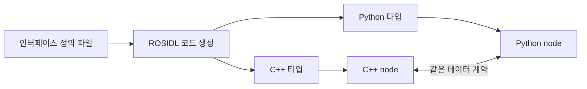

# ROS 2 인터페이스 정의 분석

> 분석 대상: [ROS 2 Lyrical — Interfaces](https://docs.ros.org/en/lyrical/ROS-Framework/interfaces/About-Interfaces.html)

## 1. 인터페이스 정의의 목적

ROS 2에서 topic, service, action은 node 사이의 통신 방식이고, **인터페이스 정의**는 그 통신에서 오가는 데이터의 계약이다. ROS 2는 단순화한 IDL(Interface Definition Language)로 이 계약을 기술한다. ROS 도구는 같은 정의에서 C++, Python 등 여러 언어용 타입 지원 코드와 자료형을 생성한다.



따라서 `.msg`, `.srv`, `.action` 파일은 단순한 데이터 구조 선언이 아니라, 언어·프로세스·장비 경계를 넘는 공개 API다. 이 파일의 필드 이름, 타입, 기본값, 배열 상한은 통신하는 모든 node에 영향을 준다.

| 파일 | 보통의 패키지 하위 경로 | 정의하는 계약 |
| --- | --- | --- |
| `.msg` | `msg/` | 하나의 메시지 타입 |
| `.srv` | `srv/` | 요청과 응답으로 구성된 service 타입 |
| `.action` | `action/` | goal, result, feedback으로 구성된 action 타입 |

어떤 경우에 topic·service·action을 택할지는 [인터페이스 유형 분석](ros2_interfaces_topics_services_actions_analysis.md)에서 다룬다. 이 문서는 선택한 통신 방식의 **타입을 어떻게 올바르게 정의하는가**에 집중한다.

## 2. `.msg`: 메시지 계약

Message는 응답을 기대하지 않고 node가 네트워크로 데이터를 보내는 방법이다. 예를 들어 온도 센서 node는 `Temperature` 메시지를 발행하고, 다른 node는 해당 메시지를 구독할 수 있다.

`.msg` 파일은 필드와 상수로 구성된다.

```msg
int32 sample_count
string sensor_name
float64 temperature_celsius
```

각 필드는 `타입 필드이름` 형식이며 공백으로 구분한다. 타입에는 내장 타입 또는 다른 message 정의의 이름을 사용할 수 있다. 다른 패키지의 message는 `패키지명/메시지명`으로 참조한다.

```msg
geometry_msgs/PoseStamped target_pose
CustomReading reading_from_same_package
```

같은 패키지의 custom message를 참조할 때는 패키지명을 쓰지 않는다.

### 내장 타입

원문이 열거한 기본 스칼라 타입은 다음과 같다.

| 분류 | 타입 |
| --- | --- |
| 논리 | `bool` |
| 8비트 | `byte`, `char`, `int8`, `uint8` |
| 정수 | `int16`, `uint16`, `int32`, `uint32`, `int64`, `uint64` |
| 실수 | `float32`, `float64` |
| 문자열 | `string`, `wstring` |

언어별 표현은 완전히 일대일 대응이 아닐 수 있다. 예를 들어 Python의 `int`나 `list`가 ROS 정의보다 넓은 값을 표현할 수 있으므로, ROS의 값 범위와 길이 제한은 소프트웨어에서 검사·강제된다. 생성된 언어 타입의 허용 범위만 보고 메시지 계약의 한계를 넓게 가정하면 안 된다.

### 배열과 경계

내장 타입은 고정 길이 배열, 무제한 동적 배열, 상한이 있는 동적 배열로 선언할 수 있다. 문자열에도 최대 길이를 둘 수 있다.

```msg
int32[] samples                 # 길이 제한 없음
int32[5] calibration_offsets    # 정확히 5개
int32[<=5] recent_errors        # 최대 5개

string device_name              # 길이 제한 없음
string<=32 frame_name           # 최대 32자
string[<=5] labels              # 문자열 최대 5개
string<=16[<=5] short_labels    # 최대 16자인 문자열 최대 5개
```

| 선언 | 의미 | 설계상 효과 |
| --- | --- | --- |
| `T[]` | 길이 제한 없는 배열 | 유연하지만 최악의 메모리·전송량을 제한하기 어려움 |
| `T[N]` | 길이가 정확히 `N`인 배열 | 센서 채널 수처럼 크기가 고정된 데이터에 적합 |
| `T[<=N]` | 최대 `N`개인 배열 | 가변 데이터의 상한을 계약으로 드러냄 |
| `string<=N` | 최대 `N`자인 문자열 | 입력 크기와 자원 사용량을 제한 |

실시간성 또는 메모리 예측 가능성이 중요한 경로에서는 상한이 없는 배열과 문자열을 무심코 사용하지 않는 편이 좋다. 반대로 실제 데이터 크기에 충분한 상한을 정하지 않으면 정상 데이터도 직렬화 또는 검증에서 거절될 수 있다.

### 필드 이름과 기본값

필드 이름은 소문자 영숫자와 단일 밑줄로 단어를 구분하는 형식이어야 한다. 첫 글자는 알파벳이어야 하며, 끝 밑줄과 연속 밑줄은 허용되지 않는다.

```msg
float64 battery_voltage  # 허용
int32 motor1_rpm         # 허용
# float64 _voltage       # 첫 글자가 알파벳이 아니므로 불가
# float64 battery__voltage # 연속 밑줄이므로 불가
```

기본값은 `타입 이름 기본값` 형태로 쓴다.

```msg
uint8 retry_count 3
int16 offset -200
string frame_id "base_link"
int32[] bins [0, 10, 20]
```

문자열 기본값은 작은따옴표 또는 큰따옴표로 감싸야 하며, 원문 기준 문자열 배열과 복합 타입(중첩 message)에는 기본값을 지정할 수 없다. 메시지 계약에서 기본값은 수신 시 빠진 필드를 채우는 JSON 같은 선택적 필드 기능이 아니다. 생성되는 새 객체의 초기값이므로, 호환성이나 의미를 숨기기 위한 용도로 쓰지 않는 것이 좋다.

### 상수

상수는 기본값과 비슷하게 선언하지만 `=`를 사용하며, 프로그램에서 바꿀 수 없다. 상수 이름은 대문자여야 한다.

```msg
uint8 STATE_IDLE=0
uint8 STATE_RUNNING=1
uint8 STATE_ERROR=2
```

상수는 상태 코드처럼 메시지 사용자 사이에서 변하지 않는 의미를 공유할 때 유용하다. 단, 단순한 수치 추가도 외부 consumer의 분기 처리에 영향을 줄 수 있으므로 공개 타입에서는 값과 의미를 안정적으로 관리해야 한다.

## 3. `.srv`: 요청과 응답

Service 정의는 request message와 response message를 `---` 한 줄로 구분한다. 두 구획은 모두 일반 message 선언 규칙을 따른다.

```srv
# request
string frame_id
geometry_msgs/Pose target
---
# response
bool accepted
string reason
```

| 구획 | 방향 | 역할 |
| --- | --- | --- |
| `---` 위 | client → server | 요청 매개변수와 요청용 상수 |
| `---` 아래 | server → client | 처리 결과와 응답용 상수 |

어떤 두 `.msg` 정의도 `---`로 연결하면 문법상 유효한 `.srv` 정의가 된다. request와 response에 각각 필드나 상수를 둘 수 있고, 다른 패키지의 message 또는 같은 패키지의 custom message를 필드로 포함할 수 있다.

```srv
# request constants and fields
uint8 MODE_SAFE=1
uint8 mode
other_pkg/Configuration requested_configuration
---
# response constants and fields
uint8 RESULT_OK=0
uint8 result_code
CustomStatus current_status
```

Service 안에 다른 service를 중첩할 수는 없다. Service는 짧은 계산 뒤 한 번 응답하는 계약이므로, 장시간 실행·중간 진행률·취소가 필요하면 action으로 모델링해야 한다.

## 4. `.action`: goal, result, feedback

Action 정의는 세 message 선언을 두 개의 `---`로 나눈다.

```action
# goal
int32 order
---
# result
int32[] sequence
---
# feedback
int32[] sequence
```

| 구획 | 역할 |
| --- | --- |
| 첫 번째 구획 | client가 server에 보낼 goal |
| 두 번째 구획 | 실행 종료 시 돌려줄 result |
| 세 번째 구획 | 실행 중 주기적으로 전달할 feedback |

원문의 Fibonacci 예에서는 client가 `order`를 보내고, server가 완료된 수열을 result로 반환하며, 수행 중에는 중간 수열을 feedback으로 보낸다. 세 구획의 필드 수는 각각 0개 이상일 수 있고, 타입과 필드 이름 규칙은 `.msg`와 동일하다.

Action은 service와 달리 실행에 수 초 또는 수 분이 걸려도 되고, feedback을 발행하며, 중단될 수 있다. action의 내부 서비스·topic 구조, goal 상태, 취소 의미는 [ROS 2 Actions 설계 분석](ros2_actions_design_analysis.md)을 참고한다.

## 5. 계약 설계와 변경 관리

인터페이스 정의는 여러 node의 독립 배포와 언어 간 통신을 묶는 경계다. 따라서 다음 기준이 필요하다.

1. **의미가 먼저다.** `data`, `value` 같은 모호한 필드보다 단위와 대상을 드러내는 `temperature_celsius`, `timeout_ms` 같은 이름을 쓴다.
2. **단위와 좌표계를 명시한다.** 숫자 타입은 단위가 없다. 이름이나 문서에서 m·rad·s, frame ID, 시간 기준을 명확히 정한다.
3. **자원 상한을 계약에 넣는다.** 최대 길이를 알 수 있는 문자열·배열은 bounded 선언을 고려한다.
4. **응답 의미를 분명히 한다.** service response의 `success`만으로 부족하면 실패 사유나 상태 코드를 추가한다.
5. **공개 타입 변경을 신중히 한다.** 필드의 이름·타입·순서·상한 변경은 이미 배포된 publisher/subscriber 또는 client/server와의 호환성에 영향을 줄 수 있다.
6. **명령의 시간 성격에 맞춘다.** 즉시 끝나는 요청은 service, 지속 데이터는 topic, 취소·feedback이 필요한 작업은 action으로 정의한다.

## 6. 구현 전 점검표

| 확인 항목 | 질문 |
| --- | --- |
| 파일 종류 | 단일 데이터, 요청·응답, goal·feedback·result 중 무엇인가? |
| 데이터 타입 | 값 범위, 부호, 정밀도, 단위는 적절한가? |
| 크기 제약 | 배열·문자열의 최악 크기와 상한을 정했는가? |
| 이름 | 필드 이름이 규칙을 지키고 도메인 의미를 전달하는가? |
| 기본값·상수 | 생성 초기값과 변경 불가 의미가 명확한가? |
| 재사용 | 표준 message 패키지에 이미 같은 의미의 타입이 있는가? |
| 호환성 | 이 정의를 바꾸면 현재 실행 중인 다른 node에 어떤 영향이 있는가? |

## 참고

- [ROS 2 Lyrical — Interfaces](https://docs.ros.org/en/lyrical/ROS-Framework/interfaces/About-Interfaces.html): `.msg`, `.srv`, `.action` 문법과 지원 타입을 설명하는 원문
- [ROS 2 documentation source](https://github.com/ros2/ros2_documentation/blob/rolling/source/ROS-Framework/interfaces/About-Interfaces.rst): 원문의 공개 소스
