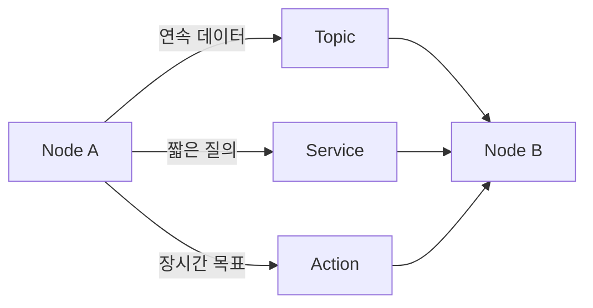
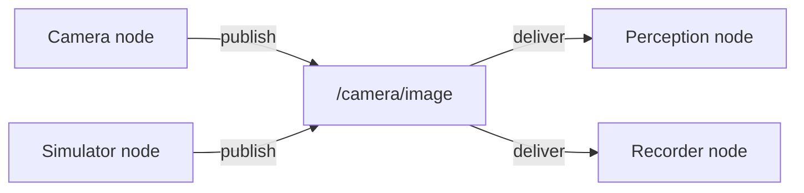
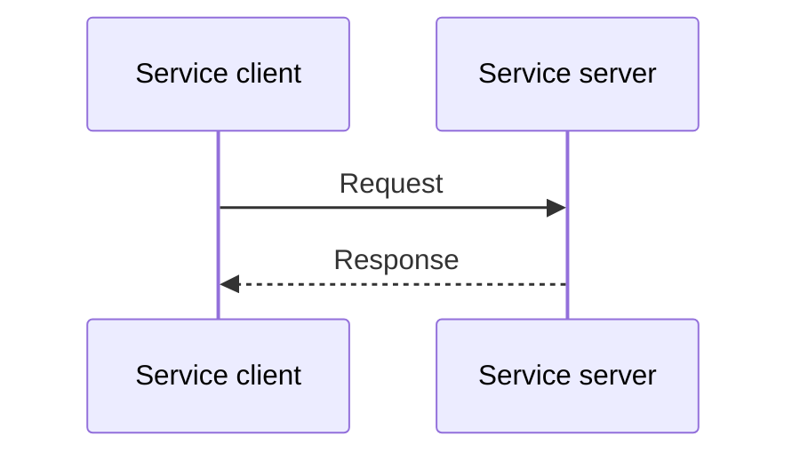
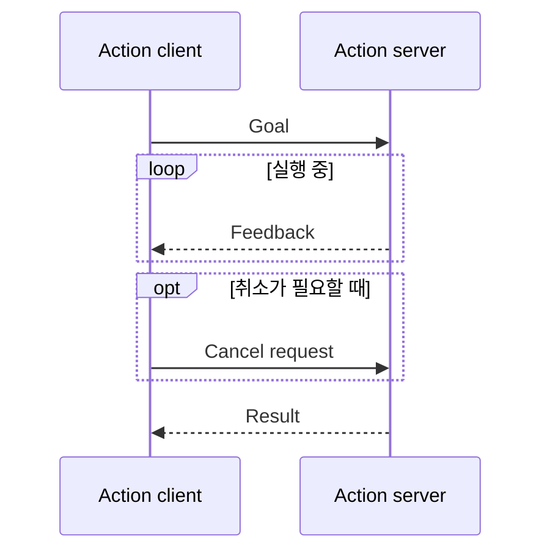
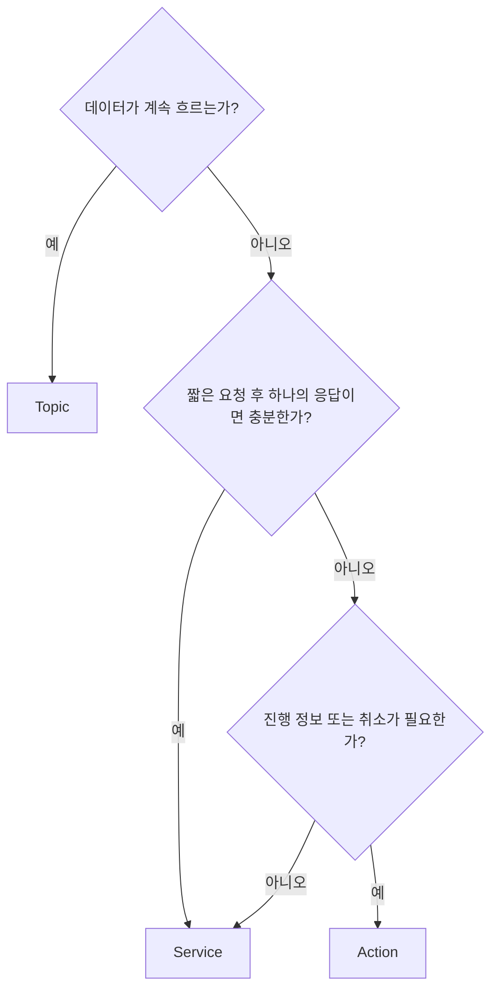

# ROS 2 인터페이스: Topics, Services, Actions 분석

> 분석 대상: [ROS 2 Lyrical — Interfaces (topics, services, actions)](https://docs.ros.org/en/lyrical/ROS-Framework/Interfaces-Topics-Services-Actions.html)

## 1. 인터페이스가 하는 일

ROS 2 인터페이스는 node가 데이터를 교환하는 **통신 계약**이다. 인터페이스를 고를 때 핵심 질문은 데이터가 계속 흐르는가, 요청에 즉시 답해야 하는가, 아니면 진행 상황과 취소가 필요한 오래 걸리는 작업인가이다.

| 인터페이스 | 통신 패턴 | 적합한 문제 |
| --- | --- | --- |
| Topic | publish / subscribe | 센서값, 로봇 상태처럼 계속 생성되는 데이터 스트림 |
| Service | request / response | 설정 조회, 계산 요청처럼 짧고 명확한 요청·응답 |
| Action | goal / feedback / result | 이동, 조작처럼 오래 걸리고 진행 관찰·취소가 필요한 작업 |

각 계약의 데이터 모양은 별도 파일로 정의한다. Topic은 `.msg`, service는 `.srv`, action은 `.action` 파일을 사용한다. 이름이 같은 채널이라도 메시지 또는 서비스 타입이 맞지 않으면 의도한 통신 계약이 성립하지 않는다.

## 2. Topic: 연속 데이터의 흐름

Topic은 publisher가 메시지를 발행하고 subscriber가 이를 받는 publish/subscribe 방식이다. 통신은 비동기·단방향이며, 하나의 topic에 publisher와 subscriber가 각각 여러 개 있을 수 있다.

### Topic을 선택할 때

- 발행자가 정한 주기에 따라 데이터가 계속 나와야 할 때
- 수신자가 없어도 발행자 역할이 의미 있을 때
- 여러 소비자가 같은 데이터를 독립적으로 받아야 할 때
- 새 값이 이전 값을 대체하거나, 수신자가 자신의 처리 속도에 맞춰 반응해야 할 때

예를 들어 카메라 이미지, LiDAR 측정값, 속도 추정치, 배터리 상태는 보통 topic에 적합하다. 반면 “현재 위치를 한 번 계산해 반환하라”나 “특정 위치로 이동하라”처럼 요청의 완료를 확인해야 하는 문제에는 service 또는 action이 더 적합하다.

### Topic key와 추적성

Topic key는 동일 topic의 개별 publisher를 식별해, node와 도구가 메시지의 출처를 구분할 수 있게 한다. 여러 publisher가 하나의 topic을 공유할 때 데이터 원인을 추적하는 데 도움이 된다. 이 기능은 topic을 여러 발행자가 공유하는 설계에서 관찰 가능성을 높인다.

### Topic statistics

Subscription에서 topic statistics를 활성화하면 ROS 2는 수신 메시지를 기준으로 다음을 측정한다.

| 지표 | 의미 |
| --- | --- |
| Message age | timestamp 기준으로 메시지가 도착했을 때의 경과 시간 |
| Message period | 연속해서 수신한 메시지 사이의 시간 간격 |

각 지표에 대해 이동 창 안의 평균, 최솟값, 최댓값, 표준편차, 표본 수를 계산한다. 결과는 정기적으로 statistics topic의 `MetricsMessage`로 발행된다. 기본 발행 간격은 1초이고 기본 statistics topic은 `/statistics`다.

이 수치는 카메라 프레임 지연, 센서 주기 흔들림, 네트워크 혼잡처럼 “수신은 되지만 시간 특성이 나쁜” 문제를 진단하는 데 유용하다. 다만 age는 메시지 timestamp의 품질과 노드 간 시간 기준에 영향을 받으므로, 수치만으로 네트워크 지연을 단정해서는 안 된다.

## 3. Service: 짧은 요청과 확정 응답

Service는 client가 request를 보내고 server가 response를 돌려주는 request/response 방식이다. 문서의 “synchronous”는 통신 의미상 요청에 대응하는 응답이 하나 존재한다는 뜻이다. 구현 API가 비동기 future를 제공하더라도 service 자체는 장기 실행 상태나 주기적 진행 보고를 모델링하지 않는다.

### Service를 선택할 때

- 빠르게 끝나는 계산의 결과가 필요할 때
- 특정 설정이나 상태를 한 번 조회할 때
- 요청이 처리되었는지 응답으로 확인해야 할 때

예를 들어 역기구학 계산, 구성 정보 조회, 짧은 초기화 명령은 service에 적합하다. 수 분 동안 수행되는 경로 이동을 service로 만들면 client가 진행률·취소·완료 상태를 자연스럽게 다룰 수 없으므로 action을 고려해야 한다.

## 4. Action: 목표, 진행 정보, 결과

Action은 client가 goal을 보내고, server가 실행 중 feedback을 제공하며, 완료 후 result를 돌려주는 인터페이스다. 필요하면 client는 취소를 요청할 수 있다.

### Action을 선택할 때

- 완료까지 시간이 걸리거나 종료 시점을 미리 알 수 없을 때
- 사용자 또는 상위 제어기가 진행률을 보여 주거나 다음 결정을 내려야 할 때
- 안전 정지나 작업 전환을 위해 취소가 필요할 때
- 최종 성공·실패·취소와 도메인별 결과를 구분해야 할 때

예를 들어 로봇을 특정 위치로 이동시키거나 복잡한 조작 동작을 수행시키는 작업이 대표적이다. Action은 내부적으로 여러 service와 topic을 조합하지만, 애플리케이션은 이를 하나의 goal 기반 인터페이스로 다룬다. 세부 프로토콜은 [ROS 2 Actions 설계 분석](ros2_actions_design_analysis.md)을 참고한다.

## 5. 세 인터페이스의 차이

| 항목 | Topic | Service | Action |
| --- | --- | --- | --- |
| 패턴 | Publish / Subscribe | Request / Response | Goal / Feedback / Result |
| 기본 방향 | 단방향 | 양방향 | feedback을 포함한 양방향 |
| 비동기성 | 비동기 | 요청·응답 완료를 기준으로 함 | 비동기 |
| 결과 제공 | 없음 | response | 최종 result |
| 진행 정보 | 별도 topic을 설계해야 함 | 제공하지 않음 | feedback으로 제공 |
| 취소 | 인터페이스 차원에서 미지원 | 인터페이스 차원에서 미지원 | 지원 |
| 대표 용도 | 연속 데이터 | 빠른 질의·명령 | 장시간 목표 수행 |

Topic에는 “완료”라는 개념이 없고 service에는 “진행 중인 작업의 제어”라는 개념이 없다. Action은 이 부족한 부분을 보완하지만 goal 식별, 상태 관리, 결과 보존 같은 추가 복잡성을 가진다. 따라서 모든 명령을 action으로 만들기보다 작업의 시간과 제어 요구를 기준으로 선택해야 한다.

## 6. 선택 절차

이 결정은 첫 설계안의 출발점이다. 이후에는 다음을 검토한다.

1. 메시지 빈도와 크기에 맞는 QoS를 정한다.
2. interface 이름과 namespace가 여러 로봇·여러 인스턴스에서 충돌하지 않게 한다.
3. 실패·timeout·재시도 시의 동작을 계약에 명시한다.
4. topic의 경우 구독자가 느릴 때의 데이터 손실 또는 적체를, service/action의 경우 server 부재와 응답 지연을 처리한다.
5. 외부에 공개할 메시지 타입을 안정적인 API로 보고 변경 호환성을 검토한다.

## 7. 설계 예시

로봇 청소 시스템을 예로 들면 다음처럼 역할을 나눌 수 있다.

| 요구 | 권장 인터페이스 | 이유 |
| --- | --- | --- |
| 레이저 거리값 전달 | Topic | 센서가 지속적으로 새 값을 발행 |
| 현재 배터리 상태 전달 | Topic | 여러 UI·관리 node가 독립적으로 구독 가능 |
| 지도 정보 한 번 조회 | Service | 짧은 요청과 단일 응답 |
| 방 청소 시작 | Action | 긴 실행 시간, 진행률, 중지 요청, 최종 결과 필요 |
| 최대 속도 변경 | Parameter 또는 짧은 Service | 동작 설정 변경이며 장기 작업이 아님 |

이처럼 interface 유형은 데이터 자체의 형태보다 **상호작용의 시간적 성격과 제어 요구**에 따라 정한다.

## 참고

- [ROS 2 Lyrical — Interfaces (topics, services, actions)](https://docs.ros.org/en/lyrical/ROS-Framework/Interfaces-Topics-Services-Actions.html): 본 문서의 원문
- [ROS 2 documentation source](https://github.com/ros2/ros2_documentation/blob/rolling/source/ROS-Framework/Interfaces-Topics-Services-Actions.rst): 원문의 공개 소스
