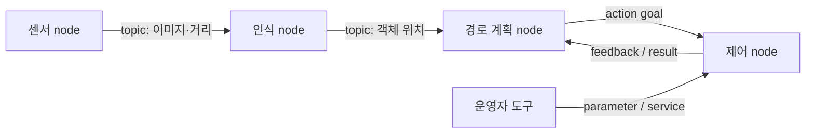
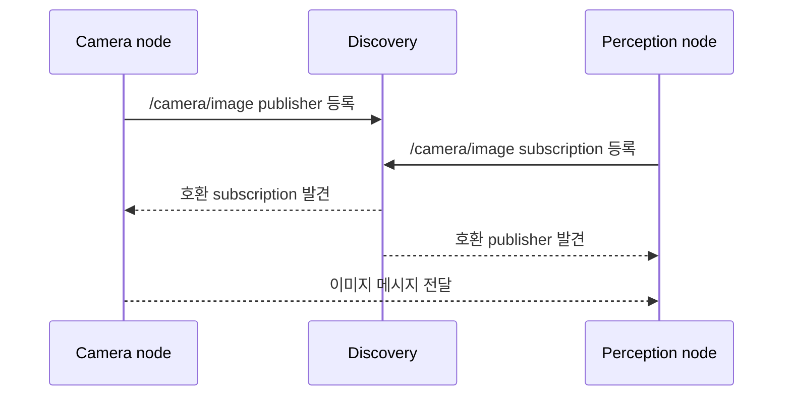

# ROS 2 Nodes 분석

> 분석 대상: [ROS 2 Lyrical — Nodes](https://docs.ros.org/en/lyrical/Concepts/Basic/About-Nodes.html)  
> 요청된 이전 경로: `ROS-Framework/About-Nodes.html`

## 1. Node의 정의

**Node는 ROS 2 graph에 참여하는 계산 단위**다. Node는 `rclcpp`(C++)나 `rclpy`(Python) 같은 client library를 통해 다른 node와 통신한다. 같은 프로세스·다른 프로세스·다른 컴퓨터에 있는 node와도 연결될 수 있다.

ROS graph는 실행 중인 ROS 2 요소와 그 연결을 나타내는 분산형 통신 그래프다. Node는 이 그래프에서 기능을 수행하는 정점이며, topic·service·action·parameter는 node 사이 또는 node 내부 설정을 위한 인터페이스가 된다.



이 그림에서 각 사각형은 하나의 node다. 중요한 점은 화살표가 프로그램 함수 호출이 아니라 이름과 타입으로 연결되는 ROS 인터페이스라는 것이다. 각 node는 상대 node의 구현보다 계약된 인터페이스에 의존한다.

## 2. "하나의 논리적 일" 원칙

공식 문서는 node를 보통 ROS graph의 계산 단위로 보며, **각 node가 하나의 논리적 일을 해야 한다**고 설명한다. 이는 파일 하나 또는 클래스 하나만 작성하라는 뜻은 아니다. 변경·재사용·관찰·장애 격리의 기준이 되는 책임 경계를 정하라는 뜻이다.

| 좋은 책임 경계 예 | 분리하는 이유 |
| --- | --- |
| 카메라 드라이버 | 장치 접근과 영상 발행을 한 곳에서 관리 |
| 객체 인식 | 입력 영상에서 의미 있는 결과를 계산 |
| 모터 제어 | 명령 검증, 안전 제약, 하드웨어 제어를 담당 |
| 경로 계획 | 현재 상태와 목표에서 경로를 계산 |

예를 들어 카메라 수집, 객체 인식, 모터 제어, 경로 계획을 각각 node로 나누면 카메라만 교체하거나 인식 알고리즘만 재시작·시험하기 쉬워진다. 반대로 항상 함께 배포되고 같은 상태·주기로 강하게 결합된 작은 기능을 과도하게 node로 쪼개면 직렬화, 통신, 배포 관리 비용이 늘 수 있다.

## 3. Node가 제공하거나 사용하는 인터페이스

하나의 node는 아래 역할을 동시에 여러 개 가질 수 있다.

| 인터페이스 | Node의 역할 | 적합한 상황 |
| --- | --- | --- |
| Topic | publisher 또는 subscription | 센서값, 상태, 명령처럼 연속적으로 흐르는 데이터 |
| Service | service client 또는 service server | 빠르게 끝나는 요청·응답 작업 |
| Action | action client 또는 action server | 진행 정보, 취소, 최종 결과가 필요한 장시간 작업 |
| Parameter | 설정 값 제공 및 변경 수신 | 실행 중 동작을 설정·조정해야 하는 경우 |

따라서 node는 단순히 publisher나 subscriber의 동의어가 아니다. 예를 들어 navigation node는 위치 topic을 구독하고, 속도 명령 topic을 발행하며, 장거리 이동 action server를 제공하고, 속도 제한 parameter를 제공할 수 있다.

## 4. Node·실행 파일·프로세스·패키지의 구분

이 개념들을 분리하면 ROS 2 구조를 정확히 읽을 수 있다.

| 용어 | 의미 | 관계 |
| --- | --- | --- |
| Package | 빌드·배포의 단위 | 여러 실행 파일, 라이브러리, launch 파일을 포함할 수 있음 |
| Executable | OS가 실행하는 프로그램 | 실행하면 하나 이상의 node를 만들 수 있음 |
| Process | 실행 중인 executable 인스턴스 | 하나 이상의 node를 담을 수 있음 |
| Node | ROS graph에서 발견되고 통신하는 논리적 계산 단위 | 프로세스 안에서 동작하며 인터페이스를 보유 |

가장 흔한 구성은 “실행 파일 하나가 프로세스 하나를 만들고, 그 프로세스가 node 하나를 실행”하는 형태다. 하지만 이는 필수 규칙이 아니다. ROS 2의 composition을 사용하면 하나의 프로세스에 여러 node를 넣을 수 있다. 이 경우에도 graph 관점에서는 각 node가 독립된 이름과 인터페이스를 가진다.

## 5. 발견과 통신 범위

Node 사이의 연결은 **분산 discovery**로 형성된다. 중앙 서버에 node를 수동 등록하는 구조가 아니라, 같은 ROS 환경 조건을 공유하는 참여자들이 서로를 발견하고 호환되는 인터페이스를 연결한다.



같은 프로세스에 있으면 intra-process 통신 최적화를 적용할 여지가 있고, 다른 프로세스나 다른 장비에 있어도 ROS graph의 동일한 통신 모델을 유지한다. 다만 실제 연결은 domain 설정, 네트워크 도달성, 인터페이스 이름·타입·QoS 호환성에 영향을 받는다.

## 6. 이름이 만드는 구조

Node 이름은 graph에서 식별과 관찰의 기준이 된다. 이름과 namespace를 사용하면 같은 기능의 node를 여러 로봇 또는 여러 인스턴스에 충돌 없이 배치할 수 있다.

```text
/robot_1/camera_driver
/robot_1/perception
/robot_2/camera_driver
/robot_2/perception
```

이 구조에서는 같은 `camera_driver` 구현을 두 로봇에서 실행해도 namespace가 다르므로 graph에서 구별된다. launch 파일에서 namespace, remapping, parameter를 함께 적용하면 구현을 바꾸지 않고 배포별 연결 구성을 바꿀 수 있다.

## 7. 설계 시 판단 기준

Node 경계를 정할 때는 다음 질문이 유용하다.

1. 이 기능은 하나의 명확한 책임으로 설명되는가?
2. 다른 기능과 독립적으로 시험·재시작·교체해야 하는가?
3. 외부에 공개할 데이터·명령·설정 계약은 무엇인가?
4. 같은 프로세스에 둘 때 얻는 지연·복사 감소 이점이, 독립 프로세스의 격리 이점보다 큰가?
5. 여러 인스턴스를 실행할 때 namespace와 parameter로 충돌 없이 구성할 수 있는가?

실무에서는 우선 책임과 인터페이스를 분명히 나누고, 성능 측정이 필요할 때 composition이나 intra-process 통신으로 최적화하는 편이 안전하다. 분리된 node 구조는 `ros2 node`, `ros2 topic`, `ros2 service`, `ros2 action` 등의 도구로 실행 중 graph를 관찰하고 문제를 좁히기에도 좋다.

## 8. Action 문서와의 연결

이 저장소의 [ROS 2 Actions 설계 분석](ros2_actions_design_analysis.md)에서 action은 장시간 작업을 위한 client/server 프로토콜로 설명한다. Node는 그 action의 실제 주체가 된다. 즉, action server node는 goal을 실행하고 feedback·result를 제공하며, action client node는 goal을 보내고 상태를 관찰하거나 취소를 요청한다.

이 관계를 통해 ROS 2는 “어떤 기능을 어느 node가 맡는가”와 “node들이 어떤 통신 계약으로 협력하는가”를 분리한다. 전자는 node 설계의 문제이고, 후자는 topic·service·action·parameter 선택의 문제다.

## 참고

- [ROS 2 Lyrical — Nodes](https://docs.ros.org/en/lyrical/Concepts/Basic/About-Nodes.html): node의 정의, 통신 수단, 분산 discovery를 설명하는 원문
- [ROS 2 Lyrical — Topics vs Services vs Actions](https://docs.ros.org/en/lyrical/How-To-Guides/Topics-Services-Actions.html): node 인터페이스 선택 기준
