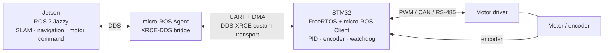

# STM32 micro-ROS UART ↔ Jetson ROS 2 Jazzy

이 문서는 STM32가 모터·encoder·fault를 처리하고 Jetson이 SLAM, navigation, 상위 제어를
수행하는 시스템을 위한 UART 기반 micro-ROS 연결 절차를 정리한다.

참조한 [lFatality/stm32_micro_ros_setup](https://github.com/lFatality/stm32_micro_ros_setup)는
STM32F429ZI에서 CubeMX, FreeRTOS, UART DMA, custom transport, micro-ROS Agent를 연결하는
예제다. 이 문서에서는 그 흐름을 ROS 2 Jazzy에 맞춰 적용한다. 참조 예제의 Docker image와
`galactic` branch는 그대로 사용하지 않는다.

## 전체 구조



Jetson은 목표 속도와 동작 명령을 발행한다. STM32는 1 kHz 수준의 PID, PWM 또는 motor-driver
통신을 로컬에서 처리한다. Jetson 또는 UART 연결이 끊겨도 STM32 watchdog이 모터 출력을 안전한
값으로 바꿔야 한다.

## 버전과 준비물

- Jetson: Ubuntu 24.04, ROS 2 Jazzy, `colcon`, Docker
- STM32: STM32CubeMX, STM32CubeIDE 또는 Makefile 기반 ARM GCC toolchain, ST-Link
- 연결: Jetson USB-UART adapter ↔ STM32 UART. 두 장치의 GND를 반드시 공통으로 연결한다.
- UART는 micro-ROS 데이터 전용으로 사용한다. 같은 UART를 terminal 프로그램이 점유하면 Agent와
  통신할 수 없다.

Jazzy용 유틸리티를 가져온다.

```bash
git clone -b jazzy https://github.com/micro-ROS/micro_ros_stm32cubemx_utils.git
```

`micro_ros_setup`과 `micro_ros_stm32cubemx_utils`에는 Jazzy branch가 있다. 참조 저장소는
Galactic을 사용하므로, 그 Docker tag나 branch를 복사하지 않는다.

## STM32CubeMX 설정

참조 저장소의 설정 중 UART custom transport에 필요한 핵심만 적용한다.

1. 프로젝트를 생성하고 HSE와 system clock을 보드에 맞게 설정한다.
2. FreeRTOS를 CMSIS-RTOS v2로 활성화한다.
3. micro-ROS task stack을 충분히 크게 잡는다. 참조 예제는 3,000 words(약 12 KB)를 사용한다.
   실제 값은 message 수, executor, 동적 할당 사용량을 기준으로 측정해 결정한다.
4. 사용할 USART/UART의 TX, RX와 DMA를 활성화한다.
5. RX DMA는 circular mode, TX/RX DMA priority는 high 또는 very high로 설정한다.
6. UART global interrupt를 NVIC에서 활성화한다.
7. CubeMX code generator는 Makefile 또는 사용하는 IDE project 형식으로 생성한다.

UART baudrate는 처음에는 `115200`으로 맞춰 bring-up한 뒤, message 크기와 주기에 따라
`921600` 등으로 올린다. Agent와 STM32 firmware의 baudrate는 반드시 같아야 한다.

## STM32 firmware에 micro-ROS 연결

생성된 STM32 프로젝트 최상위에 `micro_ros_stm32cubemx_utils`를 둔다. Makefile에는 다음
종류의 항목이 추가되어야 한다.

```make
LDFLAGS += micro_ros_stm32cubemx_utils/microros_static_library/libmicroros/libmicroros.a
C_INCLUDES += -Imicro_ros_stm32cubemx_utils/microros_static_library/libmicroros/microros_include

C_SOURCES += micro_ros_stm32cubemx_utils/extra_sources/custom_memory_manager.c
C_SOURCES += micro_ros_stm32cubemx_utils/extra_sources/microros_allocators.c
C_SOURCES += micro_ros_stm32cubemx_utils/extra_sources/microros_time.c
C_SOURCES += micro_ros_stm32cubemx_utils/extra_sources/microros_transports/dma_transport.c
```

정확한 library builder 실행 방법과 `colcon.meta` 설정은 clone한 Jazzy branch의 README를 따른다.
builder는 프로젝트의 MCU, FPU, ABI, include path에 맞는 `CFLAGS`를 받아 `libmicroros.a`를
생성한다. library를 다른 STM32 model용으로 만든 경우 link는 성공해도 runtime에서 실패할 수 있다.

FreeRTOS task 안에서는 다음 순서로 초기화한다.

```text
1. rmw_uros_set_custom_transport(... UART handle, DMA transport callbacks)
2. FreeRTOS allocator를 rcutils default allocator로 등록
3. rclc_support_init()
4. rclc_node_init_default()
5. publisher / subscription / service 초기화
6. rclc_executor_spin_some()를 주기적으로 호출
```

모터 제어 loop와 micro-ROS executor는 별도 FreeRTOS task로 둔다. executor가 잠시 지연되어도
PID loop가 멈추면 안 된다.

## 권장 ROS 2 인터페이스

초기 bring-up은 `std_msgs/msg/Int32` publisher 하나로 시작한다. Agent 연결과 topic echo를
확인한 뒤 모터 interface를 추가한다.

| 방향 | Topic / service | 권장 type | 용도 |
| --- | --- | --- | --- |
| Jetson → STM32 | `/motor/command_velocity` | `geometry_msgs/msg/Twist` 또는 custom message | 목표 선속도·각속도 |
| STM32 → Jetson | `/motor/state` | custom `MotorState` | encoder, 속도, 전류, enable 상태 |
| STM32 → Jetson | `/odom` | `nav_msgs/msg/Odometry` | wheel odometry |
| Jetson → STM32 | `/motor/enable` | `std_srvs/srv/SetBool` | driver enable/disable |
| Jetson → STM32 | `/motor/emergency_stop` | `std_srvs/srv/Trigger` | 소프트웨어 정지 요청 |

STM32에 custom message를 추가할 때는 static library builder가 그 message type을 포함하도록 설정해야
한다. 큰 image, point cloud, SLAM map은 STM32에서 다루지 않고 Jetson 쪽 ROS 2 node가 처리한다.

## Jetson에서 micro-ROS Agent 실행

별도 workspace에서 Jazzy Agent를 준비한다.

```bash
source /opt/ros/jazzy/setup.bash
mkdir -p ~/microros_agent_ws/src
cd ~/microros_agent_ws
git clone -b jazzy https://github.com/micro-ROS/micro_ros_setup.git src/micro_ros_setup
rosdep update
rosdep install --from-paths src --ignore-src -y
colcon build
source install/local_setup.bash

ros2 run micro_ros_setup create_agent_ws.sh
ros2 run micro_ros_setup build_agent.sh
source install/local_setup.bash
```

Agent는 STM32를 부팅하기 전에 실행한다. UART device와 baudrate를 실제 환경에 맞춘다.

```bash
ros2 run micro_ros_agent micro_ros_agent serial \
  --dev /dev/ttyUSB0 \
  -b 115200
```

STM32가 연결되면 Agent 로그에 client/session/participant/topic 생성 메시지가 나타난다. 그 뒤
다른 terminal에서 topic을 검사한다.

```bash
source /opt/ros/jazzy/setup.bash
ros2 topic list
ros2 topic echo /motor/state
```

`/dev/ttyUSB0` 접근 권한이 없으면 현재 사용자를 `dialout` group에 추가한 뒤 다시 로그인한다.
ST-Link virtual COM port를 쓴다면 device 이름은 `/dev/ttyACM0`처럼 달라질 수 있다.

## 안전과 장애 처리

- STM32는 마지막 motor command 수신 시각을 기록한다.
- 예: 200 ms 이상 새 명령이 없으면 목표 속도를 0으로 설정하고 motor driver를 disable한다.
- `/motor/emergency_stop`은 빠른 정지 요청일 뿐이다. 물리 E-stop과 driver enable 회로는 ROS 2,
  Jetson, UART와 독립적으로 동작해야 한다.
- Agent 재시작이나 UART 재연결 후에는 STM32가 XRCE session을 재수립하도록 `rmw_uros_ping_agent()`
  기반 reconnect 상태를 구현한다.
- 디버그 log와 XRCE data를 같은 UART에 섞지 않는다.

## 문제 해결 순서

1. Jetson에서 UART device가 보이는지 확인한다: `ls /dev/ttyUSB* /dev/ttyACM*`.
2. Agent를 먼저 실행하고 STM32를 reset한다.
3. Agent에 session 생성 log가 없다면 TX/RX 교차, 공통 GND, baudrate, UART DMA/interrupt를 확인한다.
4. session은 생성되지만 topic이 없다면 STM32의 `rclc_node_init_default()`와 publisher 초기화 반환값을
   확인한다.
5. `rclc_support_init()`에서 멈춘다면 custom transport에 전달한 UART handle과 DMA 설정을 확인한다.
6. HardFault가 나면 FreeRTOS task stack high-water mark와 static library의 MCU/FPU/ABI build 설정을
   확인한다.

## Wi-Fi ESP32와의 차이

이 문서는 STM32 UART custom transport용이다. ESP32 Wi-Fi는 UART DMA transport 대신 UDP transport를
사용하고, Jetson Agent를 `udp4` mode로 실행한다. 두 경우 모두 Jetson의 XRCE Agent가 MCU client와
일반 ROS 2 DDS graph 사이를 연결한다.
