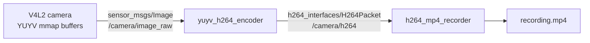
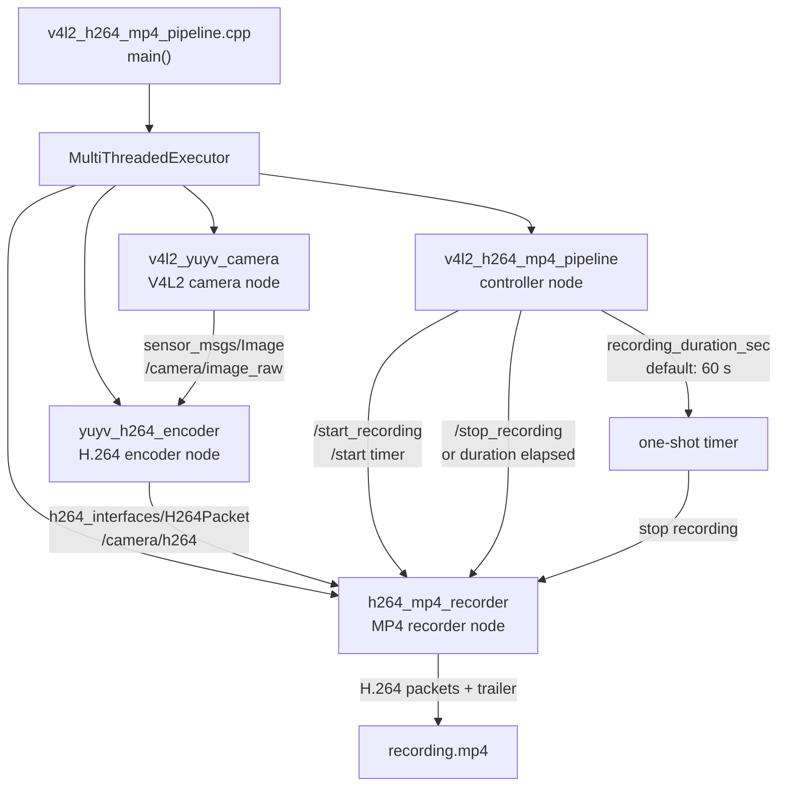

# V4L2 YUYV → H.264 → MP4 파이프라인

이 워크스페이스에는 아래 세 ROS 2 node를 추가했다.



## 통합 실행 파일의 node 관계

`v4l2_h264_mp4_pipeline`은 한 process 안에서 아래 node를 같은
`MultiThreadedExecutor`로 실행한다.



| 패키지 / 실행 파일 | 역할 |
| --- | --- |
| `v4l2_camera_cpp` / `v4l2_yuyv_camera` | `/dev/video*`에서 V4L2 single-planar `YUYV` 프레임을 mmap으로 받고 `sensor_msgs/Image`로 발행 |
| `yuv_h264_encoder_cpp` / `yuyv_h264_encoder` | `yuyv` 또는 `uyvy` `Image`를 FFmpeg `libx264`로 H.264 인코딩하고 `H264Packet`으로 발행 |
| `h264_mp4_recorder_cpp` / `h264_mp4_recorder` | H.264 packet, SPS/PPS codec configuration, PTS를 받아 FFmpeg MP4 muxer로 기록 |
| `h264_interfaces` | H.264 access unit용 `H264Packet.msg` 정의 |

## 빌드

FFmpeg 개발 패키지가 필요하다.

```bash
sudo apt install libavcodec-dev libavformat-dev libavutil-dev libswscale-dev
source scripts/setup_ros2.sh
./scripts/colcon_build.sh
source scripts/setup_ros2.sh
```

## 실행

한 process에서 세 node를 함께 실행하려면 다음 통합 실행 파일을 사용한다. 노드별 파라미터는
`node_name:parameter_name` 형식으로 지정한다.

```bash
source scripts/setup_ros2.sh
ros2 run v4l2_h264_mp4_pipeline_cpp v4l2_h264_mp4_pipeline --ros-args \
  -p v4l2_yuyv_camera:device:=/dev/video0 \
  -p v4l2_yuyv_camera:width:=640 \
  -p v4l2_yuyv_camera:height:=480 \
  -p yuyv_h264_encoder:bitrate:=4000000 \
  -p yuyv_h264_encoder:fps:=30 \
  -p yuyv_h264_encoder:gop_size:=30 \
  -p h264_mp4_recorder:output:=/absolute/path/recording.mp4 \
  -p v4l2_h264_mp4_pipeline:recording_duration_sec:=60
```

세 node는 같은 `MultiThreadedExecutor`에서 동작하고, 기존 토픽 연결
(`/camera/image_raw`, `/camera/h264`)은 그대로 유지한다. 기존 개별 실행 파일도 계속 사용할 수 있다.
통합 실행 파일은 처음에는 녹화하지 않는다. `/start_recording` service 호출 뒤 첫 keyframe부터 기록하며,
`/stop_recording` service 또는 시간 만료 시 recorder가 MP4 trailer와 index를 기록한다.
`recording_duration_sec`의 기본값은 `60`이며, start 이후 60초가 지나면 녹화만 중지한다.
`0`을 지정하면 시간 제한 없이 실행한다.

```bash
ros2 service call /start_recording std_srvs/srv/Trigger "{}"
ros2 service call /stop_recording std_srvs/srv/Trigger "{}"
```

각 node를 별도 process에서 실행하려면 터미널 세 개에서 각각 실행한다.

```bash
source scripts/setup_ros2.sh
ros2 run v4l2_camera_cpp v4l2_yuyv_camera --ros-args \
  -p device:=/dev/video0 -p width:=640 -p height:=480
```

```bash
source scripts/setup_ros2.sh
ros2 run yuv_h264_encoder_cpp yuyv_h264_encoder --ros-args \
  -p bitrate:=4000000 -p fps:=30 -p gop_size:=30
```

```bash
source scripts/setup_ros2.sh
ros2 run h264_mp4_recorder_cpp h264_mp4_recorder --ros-args \
  -p output:=/absolute/path/recording.mp4
```

녹화를 끝낼 때 recorder를 정상 종료해야 MP4 trailer와 index가 기록된다. 생성한 파일은 다음으로 확인할 수 있다.

```bash
ffprobe /absolute/path/recording.mp4
```

## 현재 범위와 성능 경로

camera node는 V4L2 mmap buffer를 `Image.data`로 복사한 뒤 바로 V4L2에 반납한다. 이는 process 경계를 넘는 표준 ROS message 경로에서 buffer 수명을 안전하게 보장하기 위한 구현이다.

복사를 줄이려면 camera와 encoder를 하나의 process로 composition하고, V4L2 buffer가 encoder에서 소비된 뒤에만 `VIDIOC_QBUF`로 반납해야 한다. 하드웨어 encoder가 DMA-BUF import를 지원하면 V4L2 capture DMA-BUF FD를 전달하는 방식으로 CPU YUV 복사를 피할 수 있다. 이 구현은 이해와 검증이 쉬운 기본 경로를 제공하며 DMA-BUF zero-copy를 아직 구현하지 않는다.
